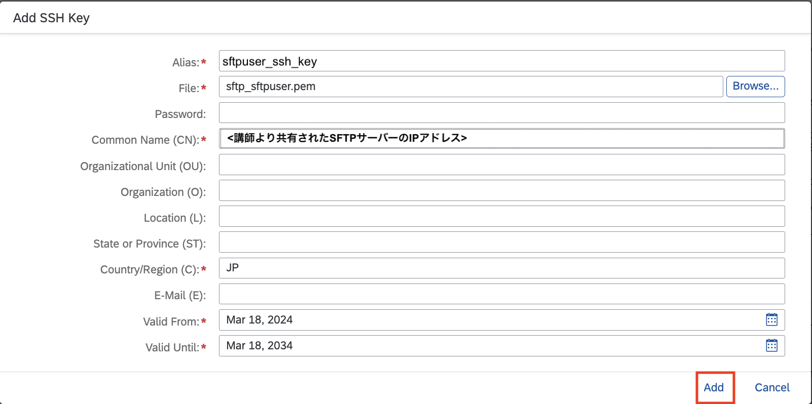

# 演習2:SAP Integration Suiteでの SFTPサーバーの設定

## 目的
本ワークショップではクラウド環境でのファイル連携の方法としてSFTP サーバーを利用します。本演習では以下の内容を実施します。
1. SAP Integration Suite の Keystore へのSSH証明書の登録
2. 登録したKeystore を用いたSFTPサーバーへの接続テスト
3. Know.host へのSFTPサーバーの登録およびSAP Integration Suiteへのアップロードおよび再度の接続テスト 

>Integration Flow Design Guidelne: SOPA→iDoc 連携のプロセスを確実に一度実施するフロー(Sender がリトライに未対応の場合)

## 手順

ステップ1: SAP Integration Suite の Keystore へのSSH証明書の登録

内容を開く

 1. Integration Suiteにアクセスします。
    
    
    
    >Integration Suite へは、URL はhttps://`ご利用のIntegration Suite のアドレス`/shell/home でアクセス出来ます。
    

 2. メニューから`Monitor` → `Integrations and APIs`を選択します。
    
    

 3. 表示された画面から`Manage Security`グループにある`Keystore` タイルを選択してください。 
    
    

 4. リストの右上にある`Add`→ `SSH Key`を選択してください。
    
    
 
 5. 開いたポップアップ画面のパラメータに以下のように入力して、`Add`ボタンを押してください。

    |パラメータ|入力項目|
    |--|--|
    |Alias:|`sftpuser_ssh_key`|
    |File:|講師より共有された`pemファイル`を参照してください。|
    |Common Unit(CN)|講師より共有されたSFTPサーバーの`IPアドレス`を参照してください。|
    |Country/Region|`JP`|
    
    
    
 6. 一覧の中に`sftpuser_ssh_key`が追加されます。確認後、ページ左上にあるリンク`Overview`を推して前画面に戻ってください。 
    
    
    

ステップ2: 登録したKeystore を用いたSFTPサーバーへの接続テスト

内容を開く

 1. `Manage Security`グループにある`Connectivity Tests` タイルを選択してください。 
    
    
    
 2. 表示された画面にあるタブから`SSH`を選択します。
    
    

 3. Resquest 画面にある以下のパラメータに以下のように入力をして、`Send`ボタンを押してください。

    |パラメータ|入力項目|
    |--|--|
    |Host:|講師より共有されたSFTPサーバーの`IPアドレス`を参照してください。|
    |Port:|`22` *デフォルトのまま|
    |Authentication:|`Public Key`を選択|
    |User Name:|`sftpuser`|
    |Private Key Alias:|ステップ1で作成した`sftpuser_ssh_key`を選択|
    |Host Key Verification:|`Off`を選択|
     
    

 4. 画面右に`Sccessfully reached host at xxx.xxx.xxx.xxx` (xxx.xxx.xxx.xxxはIPアドレス)と表示されます。
    
    
 
 5. メッセージの下の`Copy Host Key`を推します。その結果、Host Key がPCクリップボードにコピーされます。
    
    

    > クリップボードにコピーされたHost Key は念の為、Notepad 等にコピーして保存しておくことをお勧めします。
    
 6. 確認後、ページ左上にあるリンク`Overview`を推して前画面に戻ってください。 
    
    
    

ステップ3: Know.host へのSFTPサーバーの登録およびSAP Integration Suiteへのアップロードおよび再度の接続テスト

内容を開く

 1. `Manage Security`グループにある`Security Material` タイルを選択してください。 
    
    
    
 2. 表示された画面にあるリストから`known host`を選択して、ダウンロードボタンを押してください。
     
    

 3. (任意のフォルダに)ダウンロードした`known host`ファイルをnotepad等で開き、ステップ2-5.でクリップボードにコピーされた`Host Key`を追加して、ファイルを`保存`してください。
    
    
    > 画面はMacの画面となります。画面では、known host にエントリーを１つ追加した状態になっています。
 
 4. (SAP Integration Suite の画面に戻り、) `Security Material`にあるリストの右上にある`Upload` → `known host (SSH)`を押して、先ほどのステップで保存した`known host`をアップロードします。
    
    
  
 5. `Manage Security`グループにある`Connectivity Tests` タイルを選択してください。
    
    
    
 6. タブから`SSH`を選択します。
   
    

    
 7. Resquest 画面にある以下のパラメータに以下のように入力をして、`Send`ボタンを押してください。

    |パラメータ|入力項目|
    |--|--|
    |Host:|講師より共有されたSFTPサーバーの`IPアドレス`を参照してください。|
    |Port:|`22` *デフォルトのまま|
    |Authentication:|`Public Key`を選択|
    |User Name:|`sftpuser`|
    |Private Key Alias:|ステップ1で作成した`sftpuser_ssh_key`を選択|
    |Host Key Verification:|`Ageinst Tenant`を選択 *デフォルトのまま|   

    
    
 8. 画面右に`Sccessfully reached host at xxx.xxx.xxx.xxx` (xxx.xxx.xxx.xxxはIPアドレス)と表示されます。これでSFTPサーバーの接続設定が完了しました。
   
    
    
 9. 確認後、ページ左上にあるリンク`Overview`を推して前画面に戻ってください。
   
     
    
    

## まとめ
上記の設定を行うことで、SAP Integration Suite とSFTPサーバーが連携できるようになります。以降の演習ではこちらの設定を用いてSFTPサーバーとSAP Integration Suite の間でファイル連携を行います。
