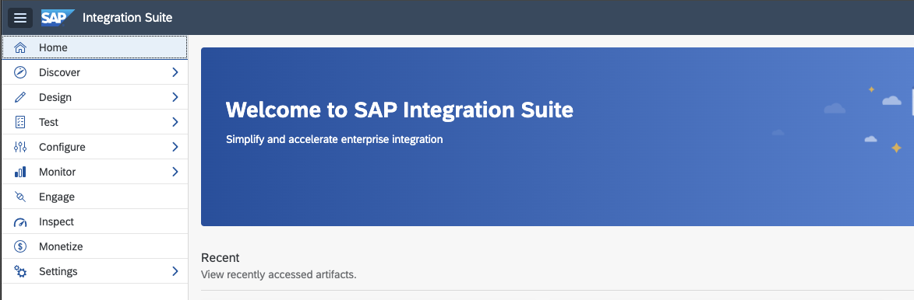
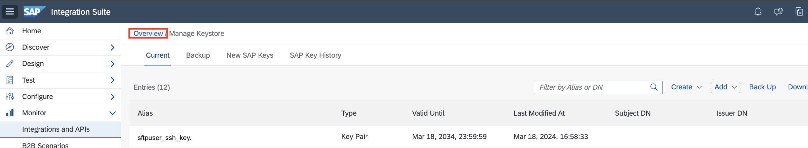

# 演習2.SAP Integration Suiteでの SFTPサーバーの設定

## 目的
本ワークショップではクラウド環境でのファイル連携の方法としてSFTP サーバーを利用します。本演習では以下の内容を実施します。
1. SAP Integration Suite の Keystore へのSSH証明書の登録
2. Keystore を用いたSFTPサーバーへの接続テスト
3. Know.host へのSFTPサーバーの登録および再度の接続テスト 

>Integration Flow Design Guidelne: SOPA→iDoc 連携のプロセスを確実に一度実施するフロー(Sender がリトライに未対応の場合)

## 手順

ステップ1: SAP Integration Suite の Keystore へのSSH証明書の登録

内容を開く

 1. Integration Suiteにアクセスします。
    
    
    
    >Integration Suite へは、URL はhttps://`ご利用のIntegration Suite のアドレス`/shell/home でアクセス出来ます。
    

 2. メニューから`Monitor` → `Integrations and APIs`を選択します。
    
    

 3. 表示された画面から`Manage Security`グループにある`Keystore` タイルを選択してください。 
    
    

 4. リストの右上にある`Add`→ `SSH Key`を選択してください。
    
    
 
 4. 開いたポップアップ画面に以下のように入力して、`Add`ボタンを押してください。

    |パラメータ|入力項目|
    |--|--|
    |Alias:|`sftpuser_ssh_key`|
    |File:|講師より共有された`pemファイル`を参照してください。|
    |Common Unit(CN)|講師より共有されたSFTPサーバーの`IPアドレス`を参照してください。|
    |Country/Region|`JP`|
    
    
    
 5. 一覧の中に`sftpuser_ssh_key`が追加されます。確認後、ページ左上にあるリンク`Overview`を推して全画面に戻ってください。 
    
    
    

## まとめ
上記の設定を行うことで、SAP Integration Suite とSFTPサーバーが連携できるようになります。以降の演習ではこちらの設定を用いてSFTPサーバーとSAP Integration Suite の間でファイル連携を行います。
