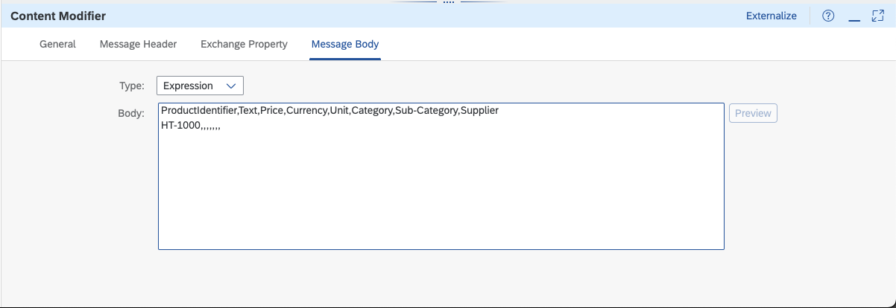
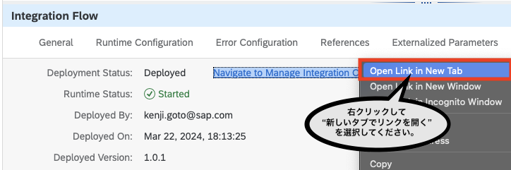
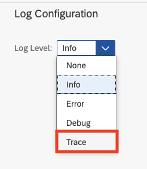

# 演習3:  最単純なIntegration Flow (iFlow) の作成と動作トレース

## 目的
本演習ではSAP Integration Suite での単純なIntegration Flow (以下、iFlow) を作成します。具体的には以下の内容を実施します。
1. SAP Integration Suit パッケージおよびiFlow の作成
2. 最単純なiFlow のステップ作成とディプロイ
3. iFlow のトレース (デバック)してプロセス終了時のMessage内部のコンテンツの確認


>本演習で作成したiFlow は次のようなステップで実行されます。
>1. ディプロイ時に`タイマーでプロセス開始`
>2. プロセス内部で`ダミーのCSV形式データ`を設定
>3. ダミーデータをMessage内に格納しプロセスを終了

## 手順

## ステップ1: SAP Integration Suit パッケージおよびiFlow の作成
<details>
<summary>内容を開く</summary>

 1. ### Integration Suiteにアクセスします。
    
    
    
    >Integration Suite へは、URL はhttps://`ご利用のIntegration Suite のアドレス`/shell/home でアクセス出来ます。
    
 2. ### メニューから`Design` → `Integrations and APIs`を選択します。
    
    

 3. ### 開いたページの右上にある`Create`ボタンを押してください。

    


 4. ### Package 作成ページのパラメータに以下のように入力して、`Save`ボタンを押してください。

    |パラメータ|入力項目|
    |--|--|
    |Name:|`Integration Suite hands on package for xx` *`xx`については講師から`指定された数字に数字に置き換え`てください。|
    |Technical Name:|Nameを入力すると自動的に入力されます。`そのまま`にしてください。|
    |Short Description|`SAP Integration Suite hands on workshop package for xx` *`xx`については講師から`指定された数字に数字に置き換え`てください。|
   
    
 
 5. ### 作成したPackage の画面が開いたら、`Artifacts`タブを選択してください。さらにArtifacts リストの上にある`Add` → `Integration Flow` を選択してください。 
    
    
    

 6. ### 開いたポップアップ画面のパラメータに以下のように入力した後に、`Add and Open in Editor`ボタンを押してください。

    |パラメータ|入力項目|
    |--|--|
    |ラジオボタン`Create`|チェック *`デフォルト`のまま|
    |Name:|`Integration Flow for xx` *`xx`については講師から`指定された数字に数字に置き換え`てください。|
    |ID:|Nameを入力すると自動的に入力されます。`そのまま`にしてください。| 
    |Runtime Profile:|`Cloud Integration` *デフォルトのまま|
    
    
    
       最終的に、Integration Flow が作成され、Editorが開いた状態になります。
    
    
    
</details>

## ステップ2: 最単純なiFlow の作成とディプロイ 
<details>
<summary>内容を開く</summary>

 1. ### Integration Flow のEditor画面の右上にある`Edit`ボタンを押して、編集モードに変更してください。。
    
    
    

 2. ### メニューから編集メニューにある`Event`の中から`Timer`イベント*を選択して、Integration Prcess 内の Start とEnd を結ぶ線上に配置してください。　* `Timerイベントは一番下にあるので、見つからなら場合は、Event自体をスクロールすると表示されます。`
    
    
    
     以下、Timer イベントをIntegration Prcess 内の Sart とEnd を結ぶ線上に配置した状態。
    

 3. ### Timer イベントを選択したままの状態で、画面右下の`Restore`ボタンを押します。
    
    

 4. ### 画面下部に表示されたTimer イベントのプロパティが表示されます。こちらの`General`タブおよび`Scheduler`タブの値を以下のように設定してください。

    `General`タブ
    |パラメータ|入力項目|
    |--|--|
    |Name:|Start Timer|
    
    

    `Scheduler`タブ
    |パラメータ|入力項目|
    |--|--|
    |ラジオボタン `Run Once`|チェック *`デフォルト`のまま|
    
    

    この設定で`iFlow がデプロイされたタイミングで、プロセスが開始`されるようになります。

    >Time イベントのその他のパラメータの意味などは、SAP Help の[こちら](https://help.sap.com/docs/cloud-integration/sap-cloud-integration/define-timer-start-event)をご確認ください。
 
 5. ### `デフォルトのStart` イベントを選択すると、メニューが表示されます。一番下にある`Delete`ボタンを押して、`デフォルトのStart` イベントを削除してください。

       
 
 6. ### メニューから編集メニューにある`Transformation`の中から`Content Modifier`イベントを選択して、Integration Prcess 内の `Time Start` とEnd を結ぶ線上に配置してください。

    
    
    以下、Content Modifier をIntegration Prcess 内の `Timer Sart` とEnd を結ぶ線上に配置した状態。

    
    
 7. ### 画面下部のContent Modifier のプロパティが表示されます。(もしも表示されない場合は、画面右下の`Restore`ボタンを押してプロパティを開いてください。) こちらの`General`タブおよび`Message Body`タブの値を以下のように設定してください。
   
    `General`タブ
    |パラメータ|入力項目|
    |--|--|
    |Name:|`Set dummy data`|
    
    

    `Message Body`タブ
    |パラメータ|入力項目|
    |--|--|
    |Type:|`Expression` *デフォルトのまま|
    |Body:|以下のコードをコピーしてください。|
    ```csv
    ProductIdentifier,Text,Price,Currency,Unit,Category,Sub-Category,Supplier
    HT-1000,,,,,,,
    ```
    
    

    >Content Modifier のその他のパラメータの意味などは、SAP Help の[こちら](https://help.sap.com/docs/cloud-integration/sap-cloud-integration/define-content-modifier)をご確認ください。
      
 8. ### 画面右上にある`Save as Version`ボタンを押して、開いたポップアップ画面のパラメータに以下のように入力した後に、`OK`ボタンを押してください。

    
     
    |パラメータ|入力項目|
    |--|--|
    |Version:|`デフォルト`のまま|
    |Comment:|`Simplest Integration Flow`|

     
     
 9. ### 画面右上にある`Deploy`ボタンを押して、作成したiFlow をディプロイしてください。ポップアップ画面が開いたら、そのまま`Yes`ボタンを押してください
    
     
     
     表示されたポップアップ画面はそのまま`Yes`ボタンを押してください。その後、Triggered Deployment を表すポップアップ画面が出ますので、`OK`ボタンを押してください。

     
     
     Triggered Deployment を表すポップアップ画面

     
   
 10. ### Editorの空白部分(Integration Process の箱の下あたり。)を選択して、下に`Integration Flow`のプロパティが表示されます。その中にある`Deployment Status`タブを開き、以下のプロパティが、それぞれ指定の状態になっていることを確認してください。　*Deployment には少し時間がかかる場合があります。ステータスが変更されるまで、少しお待ちください。
   
     
     

     `Integration Flow`のプロパティ画面
     
     
     |パラメータ|表示されるべき値|
     |--|--|
     |Deplyoment Status:|`Deployed`|
     |Runtime Status:|`Started`|
     
     上記のように表示された場合には、`iFlow が開始された状態`になります。
   
</details>

## ステップ3: iFlow のトレース (デバック) してプロセス終了時のメッセージ内部のコンテンツの確認
<details>
<summary>内容を開く</summary>

 1. ### Integration Flow のプロパティの`Deployment Status`タブにある項目`Deployment Status`の横にある`Navigate to Manage Integration Content`のリンクを右クリックして`新しいタブでリンクを開く`を選択して、リンク先を新しいタブで開いてください。*この画面ではiFlow のトレースに利用しますので、`開いたまま`にしてください。
    
    
    
    >　上記画面はMac版のGoogle Chome のものです。  

 2. ### 開かれたManage Integration Content画面にある左のリストから作成した`Integration Flow for xx` (`xxについては講師から指定された数字に数字`)を選択してください。
    
    

 3. ### 表示された`Integration Flow for xx`の情報の最後にある`Log Configration`セクションにある`Log Level`を`info`→`Trace`に変更してください。ログレベル変更の確認のポップアップ画面が表示されますので、`Change`ボタンを押してください。その結果としてログレベルが変更された旨のメッセージが表示されます。 
    
    

    ログレベル変更確認のポップアップ画面

    
    
    ログレベル変更された旨のメッセージ表示

    

 4. ### Integration FLow のDesigner 画面のタブに戻ります。 (Manage Integration Content 画面のタブはすぐに使いますので、`閉じない`でください。)
    
    
    
 5. ### (Desginer の) 画面右上にある`Deploy`ボタンを押して、作成したiFlow を再度ディプロイしてください。ポップアップ画面が開いたら、そのまま`Yes`ボタンを押してください
    
     
     
     表示されたポップアップ画面はそのまま`Yes`ボタンを押してください。その後、Triggered Deployment を表すポップアップ画面が出ますので、`OK`ボタンを押してください。

     
     
     Triggered Deployment を表すポップアップ画面

     
   
 6. ### Editorの空白部分(Integration Process の箱の下あたり。)を選択して、下に`Integration Flow`のプロパティが表示されます。その中にある`Deployment Status`タブを開き、以下のプロパティが、それぞれ指定の状態になっていることを確認してください。　*Deployment には少し時間がかかる場合があります。ステータスが変更されるまで、少しお待ちください。
   
     
     

     `Integration Flow`のプロパティ画面
     
     
     |パラメータ|表示されるべき値|
     |--|--|
     |Deplyoment Status:|`Deployed`|
     |Runtime Status:|`Started`|
     
     上記のように表示された場合には、iFlow が開始され`トレースが記録された状態`になります。
   
 7. ### 再びManage Integration Content 画面のタブに戻り、`Integration Flow for xx`を選択して、 `Artifical Details`セクションにあるリンク`Monitor Message Processing`を押してください。
   
    
    
 8. ### その結果として、Monitor Message Processing 画面が表示されます。この画面の左側のプロセスされたメッセージの一覧がリストで表示されます。その中から`Status`が`Completed`になっているもを選択してください。(複数ある場合は、`Completed`になっているエントリーから`一番最新のもの`=一番上のものを選択してください。)
   
     

 9. ###  表示された`Integration Flow for xx`の情報の三番目にある`Log`セクションにある`Log Level`の`Trace`のリンクをクリックしてください。
    
     

 10. ### 結果としてMessage のプロセス情報を示すMessage Processing Run 画面が表示されます。ここからトレース内容を確認ます。左のリストにある`End`を選択してください。これにより右にあるiFlow の図にあるEnd Event が強調表示されます。(これにより`End Event` が実行された直後のトレース情報を確認することができます。)

     
     
 11. ### iFlow の図の上にある`Log Content`を選択してください。さらに`Properties`を選択してください。`Properties`の状態が表示されます。(こちらでは`End Event` の持つ基本情報です。)

     
     
 12. ### `Activities`(`Properties`の右横)を選択してください。`Activites`の状態が表示されます。(こちらでは`End Event`で実行された内容が確認できます。)

     
     
 13. ### 次に`Message Content`(`Log COntent`の右横)を選択してください。さらに`Header`を選択してください。(こちらではEnd Event 時点でのMessage の`Header` 情報が表示されます。)

     
     
 16. ### `Exchange Properties`(`Header`の右横)を選択してください。`End Event` 時点での`Exchange Properties` が表示されます。
     
     
     
 17. ### `Payload`(`Exchange Properties`の右横)を選択してください。`End Event` 時点での`Payload` ( = Message のBody)が表示されます。これでダミーで設定したCSVファイルの内容が、正しくセットされていることが確認できました。

     
     
</details>

## まとめ
本演習では、最単純なiFlow を作成することで、フローを作成する際に必要な手順を理解することが出来ます。またiFlow をトレースすることでステップごとのMessage の中身を確認することが出来ます。これによってデバックしながらiFlowを調整することが出来ます。Messageに関してはSAP Help の[こちら](https://help.sap.com/docs/integration-suite/sap-integration-suite/camel-data-model-in-nutshell?locale=en-US)をご確認ください。
