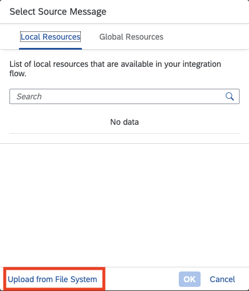
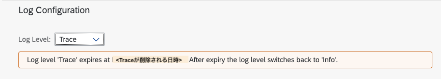
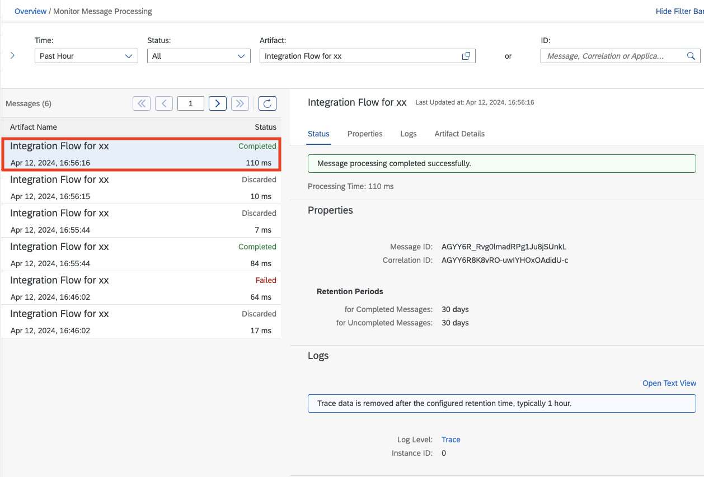

# 演習4: Message Mapping の利用

## 目的
本演習ではiFlow 内のMessage のBody 部分に格納されているPayload を加工します。具体的には以下の内容を実施します。
1. Converter 機能を利用してCSV形式のデータをXML形式のデータに変換
2. Message Mapping 機能を利用して異なる項目にデータをマッピング
3. iFlow をトレース(デバック)付き実行して、プロセス終了時のMessage内のPayload がXML形式で格納されていることを確認

>本演習で作成したiFlow は次のようなステップで実行されます。
>1. ディプロイ時にタイマーでプロセス開始
>2. プロセス内部でダミーのCSV形式データを設定
>3. `ダミーデータをCSV形式からXML形式に変換`*
>4. `Message 内部でデータをマッピングして、異なる項目にデータをマッピング(例: 項目ProductIdentifierから項目ProductIDへ)`*
>5. `ダミーデータをMessage内のPayload にデータを変換してXML形式で格納しプロセスを終了`*
>   
>*本演習で拡張した結果として追加もしくは変更されたステップ

## 手順

## ステップ1: Converter 機能を利用してCSV形式のデータをXML形式のデータに変換

内容を開く

1. ### Integration Flow のDesigner 画面のタブに戻ります。そしてIntegration Flow のEditor画面の右上にある`Edit`ボタンを押して、編集モードに変更してください。。

   

2. ### メニューから編集メニューにある`Message Transformers`の中から`Converter`→`CSV to XML Converter`を選択して、Integration Prcess 内の `Set Dummy Data` とEnd を結ぶ線上に配置してください。

   

   以下、`CSV to XML Converter`を選択して、Integration Prcess 内の `Set Dummy Data` とEnd を結ぶ線上に配置した状態
   
   

3. ### (もしもプロパティパネルが隠れている場合は)`CSV to XML Converter`を選択したままの状態で、画面右下の`Restore`ボタンを押します。

   

4. ### 画面下部に表示された`CSV to XML Converter`のプロパティが表示されます。こちらの`General` タブおよび`Processing` タブの値を以下のように設定してください。

    `General`タブ
    |パラメータ|入力項目|
    |--|--|
    |Name:|`CSV To XML Converter`|

        
   
    `Processing`タブ
    |パラメータ|入力項目|
    |--|--|
    |XML Schema:|`Select`ボタンを押して、開いたポップアップ画面左下の`Upload from File System`ボタンを押して、ファイル`Product_sender.xsd`をアップロードしてください。|
    |Path to Target Element in XSD:|`/Product`|
    |Record Marker in CSV:|`空白`|
    |Field Separator in CSV:|`Comma(,)`|
    |Exclude First Line Header:|`チェック`|
    |Configure CSV Headers to match:|`XSD Elements` *デフォルトのまま|

    

    >CSV to XML Converter のその他のパラメータの意味などは、SAP Help の[こちら](https://help.sap.com/docs/cloud-integration/sap-cloud-integration/configure-csv-to-xml-converter)をご確認ください。
      
5. ### 画面右上にある`Save`ボタンを押して、作成してものを保存してください。

   

## ステップ2: Message Mapping 機能を利用して異なる項目にデータをマッピング

内容を開く
   

1. ### メニューから編集メニューにある`Mapping` の中から`Message Mapping`を選択してIntegration Process内の `CSV to XML Converter` とEnd を結ぶ線上に配置してください。 

   
   
   以下、`Message Mapping`を選択して、Integration Prcess 内の `CSV to XML Converter` とEnd を結ぶ線上に配置した状態
   
   

2. ### もしもプロパティパネルが隠れている場合は)`Message Mapping`を選択したままの状態で、画面右下の`Restore`ボタンを押します。

   

3. ### 画面下部に表示された`Message Mapping`のプロパティが表示されます。こちらの`General` タブの値を以下のように設定してください。

    `General`タブ
    |パラメータ|入力項目|
    |--|--|
    |Name:|`Message Mapping`|

        

4. ### Integration Process 内の`Messasge Mapping`を選択してメニューから`Create`を選択してください。

    

5. ### 開いたポップアップ画面`Create Message Mapping`でNameを`xsd_mapping_xx`と入力して`Create`ボタンを押してください。(*xxについては講師から指定された数字に数字に置き換えてください。)

    

6. ### 結果として表示された`xsd_mapping_xx`(*xxについては講師から指定された数字に数字に置き換えてください。)画面の左右に表示されたStructure のうち`左側の`Structureの上にある`Add source message`ボタンを押してください。

   
   
7. ### 開いたポップアップ画面`Select Source Message`の左下にある`Upload from File System`ボタンを押して、[`Product_sender.xsd`](sources/Product_sender.xsd)をアップロードしてください。結果として受信側のデータ構造がXML形式(CSV形式をステップ1でXML形式に変更したデータ構造に対応)で取り込まれます。これによってXML形式に変換されたデータを取り込みます。

   

   以下、受信側のデータ構造がXML形式で取り込まれた状態。

   

8. ### 左右に表示されたStructure のうち`右側の`Structureの上にある`Add source message`ボタンを押してください。

   
   
9. ### 開いたポップアップ画面`Select Source Message`の左下にある`Upload from File System`ボタンを押して、[`ProductSet_receiver.xsd`](sources/ProductSet_receiver.xsd)をアップロードしてください。結果として送信側のデータ構造がXML形式で取り込まれます。これによってXML形式でデータを出力することができます。

   

   以下、受信側のデータ構造がXML形式で取り込まれた状態。

   

10. ### 左側のStructure の`Product`を選択して、`矢印のついたアイコン`から線をひっぱり出して、右側のStructure の`ProductSet`の下にある`Product`まで引っ張ってください。
   
     
    
11. ### 右上の２段目にある右から２つ目のアイコン(`Ab`と表記されているアイコン)を押してください。結果として、左右のStructure にある同じ名前のそれぞれの項目が自動的にマッピングされます。
   
    
    
12. ### 左右のStructure で項目名が異なるが、同じ項目は１つ１つ手動でマッピングできます。ここでは左側のStructure の`ProductIdentifier`と右側のStructureの`ProductID`をマッピングします。まず左側のStructure の`ProductIdentifier`を選択して、`矢印のついたアイコン`から線をひっぱり出して、右側のStructure の`ProductID`まで引っ張ってください。
   
     

13. ### 右上にある`Simulate`ボタンを押してください。結果としてSimulate 用のポップアップ画面が開きます。

      

      以下、ポップアップ画面が開いた状態

       

14. ### 左上にある`Test Input`の項目に右にある`Browse`ボタンを押してファイル[`Product.xml`](sources/Product.xml)をアップロードしてください。結果としてサンプルの`Product`データが受信データとして取り込まれます。

       

      以下、受信側のサンプルデータが取り込まれた状態。

       

15. ### 右下にある`Test`ボタンを押して、シミュレーションを実行してください。(少し時間が経過したのちに)右側にある`Test Output`にマッピング結果が表示されます。こちらが以下のように正しく表示されているかどうか確認してください。

    　

      以下、シミュレーションが完了した状態。

       

      >確認するポイントは以下の通りです。
      >1. Test Output の項目`Product ID`に正しく`HT-1000`が格納されていること。
      >2. それ以外の項目に関しては、Test Input にある同じ項目名の値が正しく格納されていること。
    
16. ### 右下にある`Close`ボタンを押して、シミュレーションのポップアップ画面を押して画面を終了させてください。
   
    

17. ### `xsd_mapping_xx`(*xxについては講師から指定された数字に数字に置き換えてください。)画面の右上にある`OK`ボタンを押して、終了をさせてください。
   
    

18.  ### 画面右上にある`Save as Version`ボタンを押して、開いたポップアップ画面のパラメータに以下のように入力した後に、`OK`ボタンを押してください。

     |パラメータ|入力項目|
     |--|--|
     |Version:|`デフォルト`のまま|
     |Comment:|`Add Message Mapping`|
     
     
     
   

## ステップ3:  iFlow を実行して、トレース(デバック)してプロセス終了時のMessage内のPayload がXML形式で格納されていることを確認

内容を開く

 
1. ### (`注意:` もしも`Manage Integration Content`タブが閉じている場合のみ) Integration Flow のプロパティの`Deployment Status`タブにある項目`Deployment Status`の横にある`Navigate to Manage Integration Content`のリンクを右クリックして`新しいタブでリンクを開く`を選択して、リンク先を新しいタブで開いてください。
    
   
    
    >　上記画面はMac版のGoogle Chome のものです。  

 2. ### 開かれたManage Integration Content画面にある左のリストから作成した`Integration Flow for xx` (`xxについては講師から指定された数字に数字`)を選択してください。
    
    

 3. ### 表示された`Integration Flow for xx`の情報の最後にある`Log Configration`セクションにある`Log Level`を`info`→`Trace`に変更してください。ログレベル変更の確認のポップアップ画面が表示されますので、`Change`ボタンを押してください。その結果としてログレベルが変更された旨のメッセージが表示されます。 
    
    

    ログレベル変更確認のポップアップ画面

    
    
    ログレベル変更された旨のメッセージ表示

    

 4. ### Integration FLow のDesigner 画面のタブに戻ります。 (Manage Integration Content 画面のタブはすぐに使いますので、`閉じない`でください。)
    
    
    
 5. ### (Desginer の) 画面右上にある`Deploy`ボタンを押して、作成したiFlow を再度ディプロイしてください。ポップアップ画面が開いたら、そのまま`Yes`ボタンを押してください
    
     
     
     表示されたポップアップ画面はそのまま`Yes`ボタンを押してください。その後、Triggered Deployment を表すポップアップ画面が出ますので、`OK`ボタンを押してください。

     
     
     Triggered Deployment を表すポップアップ画面

     
   
 6. ### Editorの空白部分(Integration Process の箱の下あたり。)を選択して、下に`Integration Flow`のプロパティが表示されます。その中にある`Deployment Status`タブを開き、以下のプロパティが、それぞれ指定の状態になっていることを確認してください。　*Deployment には少し時間がかかる場合があります。ステータスが変更されるまで、少しお待ちください。
   
     
     

     `Integration Flow`のプロパティ画面

    
     
     |パラメータ|表示されるべき値|
     |--|--|
     |Deplyoment Status:|`Deployed`|
     |Runtime Status:|`Started`|
     
     上記のように表示された場合には、iFlow が開始され`トレースが記録された状態`になります。
   
 8. ### 再びManage Integration Content 画面のタブに戻り、`Integration Flow for xx`を選択して、 `Artifical Details`セクションにあるリンク`Monitor Message Processing`を押してください。
   
    
    
 9. ### その結果として、Monitor Message Processing 画面が表示されます。この画面の左側のプロセスされたメッセージの一覧がリストで表示されます。その中から`Status`が`Completed`になっているもを選択してください。(複数ある場合は、`Completed`になっているエントリーから`一番最新のもの`=一番上のものを選択してください。)
   
     

 10. ###  表示された`Integration Flow for xx`の情報の三番目にある`Log`セクションにある`Log Level`の`Trace`のリンクをクリックしてください。
    
     

 11. ### 結果としてMessage のプロセス情報を示すMessage Processing Run 画面が表示されます。ここからトレース内容を確認ます。左のリストにある`End`を選択してください。これにより右にあるiFlow の図にあるEnd Event が強調表示されます。(これにより`End Event` が実行された直後のトレース情報を確認することができます。)

     
     
 12. ### iFlow の図の上にある`Message Content`(`Log COntent`の右横)を選択してください。さらに`Payload`を選択してください。`End Event` 時点での`Payload` ( = Message のBody)が表示されます。これでダミーで設定したCSVファイルの内容が、`XML`形式に変換されてセットされていることが確認できました。
    
     

## まとめ
本演習では、Integration Suite の持つ機能を用いてプロセス上必要なデータのフォーマットをCSVからXMLに変換したり、マッピング機能を用いて異なるストラクチャ構造の項目にマッピングする方法を理解することができます。
