# 演習5: ODataアダプターを用いたSAPシステムへの連携

## 目的
本演習ではiFlow からS/4HANAシステムを呼出して製品データを取得します。このS/4HANAの呼出しは、さまざまな種類のインターフェースを利用することが出来ますが、今回の演習ではOData方式のWwebサービス(SAP Integration SuiteでAPIとして事前設定済み)を利用します。具体的には以下の内容を実施します。
1. Content Modifier を用いてPayload 内のProduct IDを取得してExchange Property として設定
2. S/4HANA(ODataサービスを利用)を呼び出す設定
3. iFlow をトレース(デバック)付き実行して、プロセス終了時のMessage内のPayload にS/4HANAから取得した製品データが格納されていることを確認

>本演習で作成したiFlow は次のようなステップで実行されます。
>1. ディプロイ時にタイマーでプロセス開始
>2. プロセス内部でダミーのCSV形式データを設定
>3. ダミーデータをCSV形式からXML形式に変換*
>4. Message 内部でデータをマッピングして、異なる項目にデータをマッピング(例: 項目ProductIdentifierから項目ProductIDへ)
>5. `Payload 内のProductIDを取得してExchange Property として設定`*
>6. `Exchange Property として設定したProductIDを利用して、この製品に関するデータをS/4HANAシステムからODataを利用して取得`*
>7. `S/4HANAシステムから取得した製品データをMessage内のPayload に格納しプロセスを終了`*
>   
>*本演習で拡張した結果として追加もしくは変更されたステップ

## 手順

## ステップ1: Content Modifier を用いてPayload 内のProduct IDを取得してExchange Property として設定

内容を開く

1. ### Integration Flow のDesigner 画面のタブに戻ります。そしてIntegration Flow のEditor画面の右上にある`Edit`ボタンを押して、編集モードに変更してください。
  
   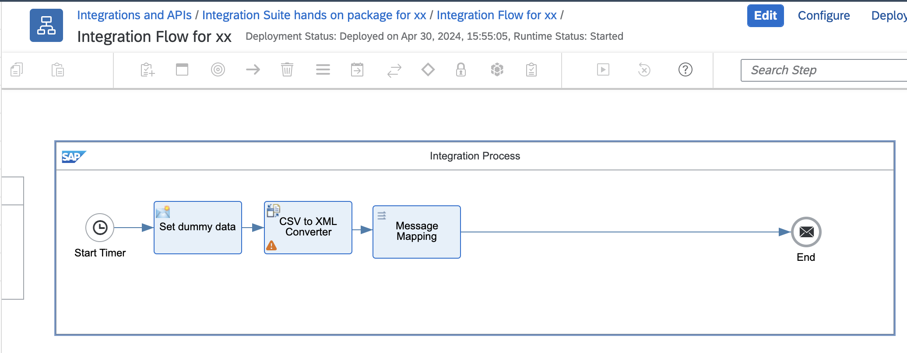

2. ### メニューにある`Message Transformers`の中から`Content Modifier`を選択して、Integration Flow 内の`Message Mapping`とEnd を結ぶ線上に配置してください。
  
   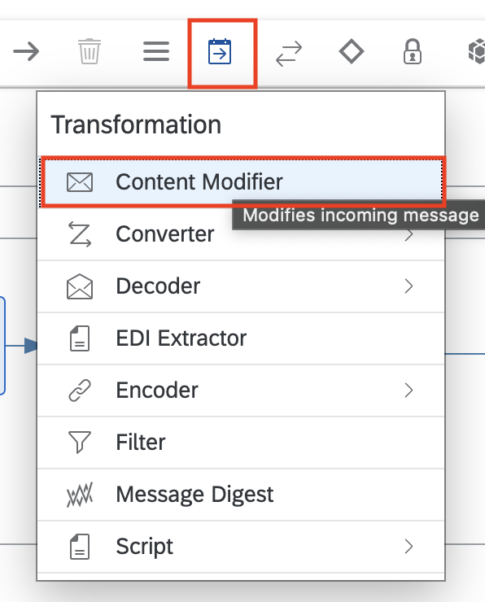

   以下、`Content Modifier`を選択して, Integration Process 内の`Message Mapping` とEnd を結ぶ線上に配置した状態

   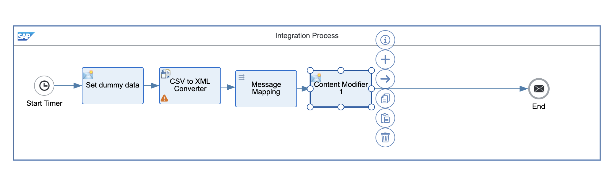
   
3. ### (もしもプロパティパネルが隠れている場合は)`Content Modifier`を選択したままの状態で、画面右下の`Restore`ボタンを押します。

   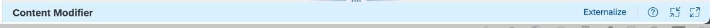

4. ### 画面下部に表示された`Content Modifier`のプロパティが表示されます。こちらの`General` タブおよび`Exchange Property` タブの値を以下のように設定してください。

    `General`タブ
    |パラメータ|入力項目|
    |--|--|
    |Name:|`add Exchange Property "ProductID"`|

        
   
    `Exchange Property`タブ
    |パラメータ|入力項目|
    |--|--|
    |Action:|`Create`を選択|
    |Name:|`ProductID`|
    |Source Type:|`XPath`を選択|
    |Source Value:|`//ProductID`|
    |Data Type:|`java.lang.String`　*大文字小文字は別の文字として判断されますので、必ずご確認ください。|
    
    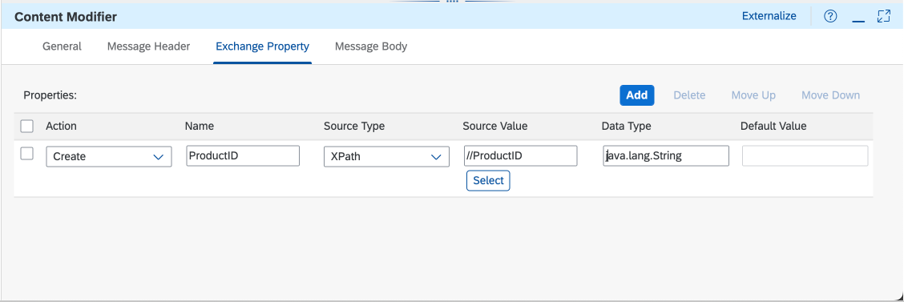

    >Content Modifier のその他のパラメータの意味などは、SAP Help の[こちら](https://help.sap.com/docs/cloud-integration/sap-cloud-integration/define-content-modifier)をご確認ください。

5. ### 画面右上にある`Save`ボタンを押して作成してものを保存してください。
  
   

## ステップ2: S/4HANA(ODataサービスを利用)を呼び出す設定

内容を開く

1. ### メニューにある`Call`の中にある`Extranal Call` → `Request Reply`を選択してIntegration Process内の`add Exchange Property "ProductID"`とEnd を結ぶ線上に配置してください。
  
   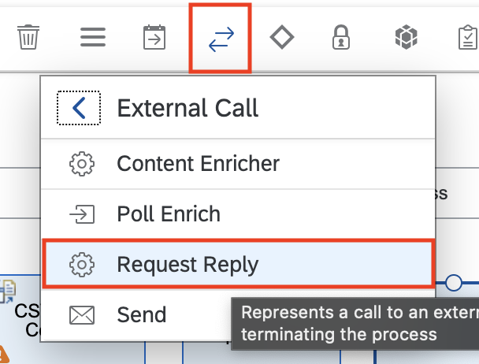

   以下、`Request Reply`を選択して、Integration Process 内の`add Exchange Property "ProductID"`とEnd を結ぶ線上に配置した状態

   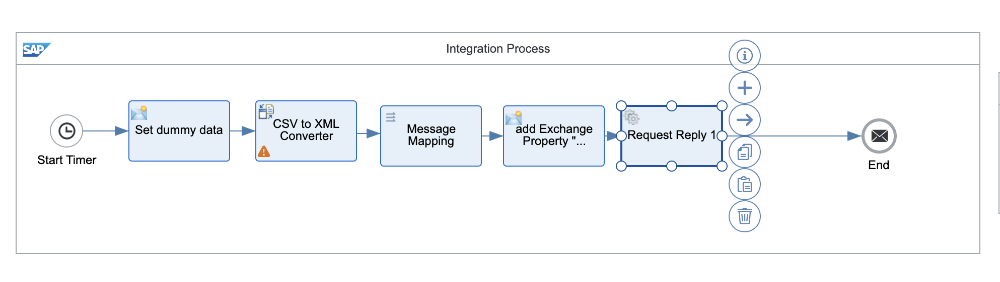

2. ### (もしもプロパティパネルが隠れている場合は)`Request Reply`を選択したままの状態で、画面右下の`Restore`ボタンを押します。
   
   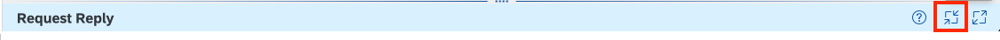

3. ### 画面下部に表示された`Request Reply`のプロパティが表示されます。こちらの`General` タブおよび`Processing` タブの値を以下のように設定してください。

    `General`タブ
    |パラメータ|入力項目|
    |--|--|
    |Name:|`call S/4HANA System with ODATA API`|

     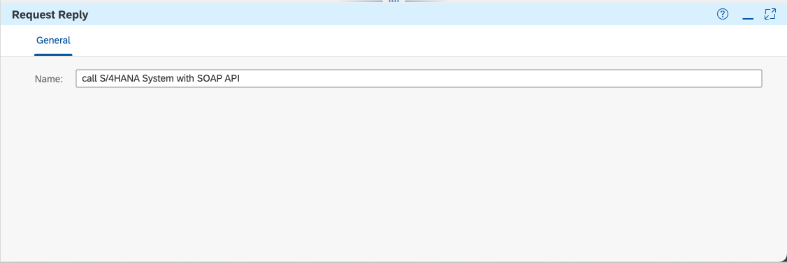   

4. ### メニューにある`Participant`の中にある`Receiver`を選択して`call S/4HANA System with ODATA API`の真下あたりに配置してください。
  
   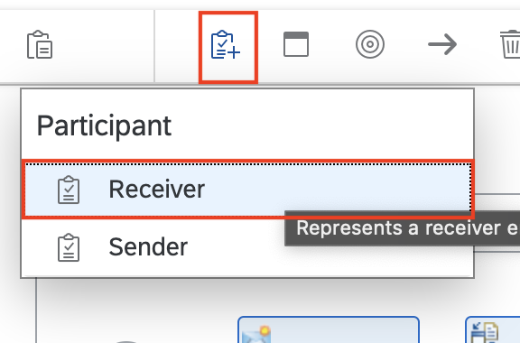

   以下、`Receiver`を選択して、Integration Process の外の`call S/4HANA System with ODATA API`の真下あたりに配置した状態

   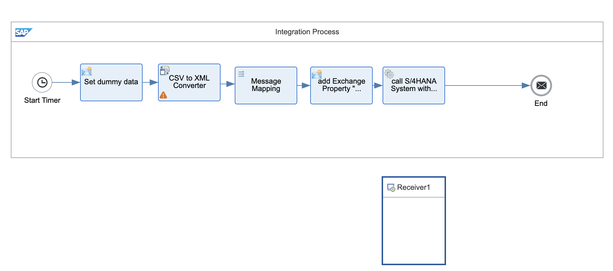

5. ### (もしもプロパティパネルが隠れている場合は)`Receiver`を選択したままの状態で、画面右下の`Restore`ボタンを押します。
   
   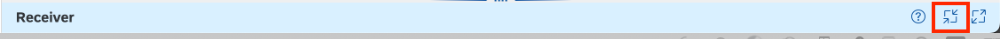

6. ### 画面下部に表示された`Receiver`のプロパティが表示されます。こちらの`General` タブの値を以下のように設定してください。

    `General`タブ
    |パラメータ|入力項目|
    |--|--|
    |Name:|`S4HANA` * 空白は不可|

     

7. ### Integration Process 内の`call S/4HANA System with ODATA API`を選択してメニューから`Connector`を選択して`S4HANA`に接続してください。
  
   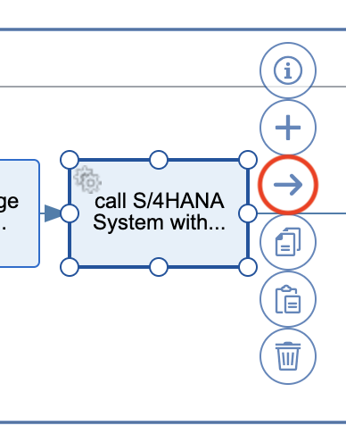

   接続された状態は以下のようになり、ポップアップ画面が開きます。

   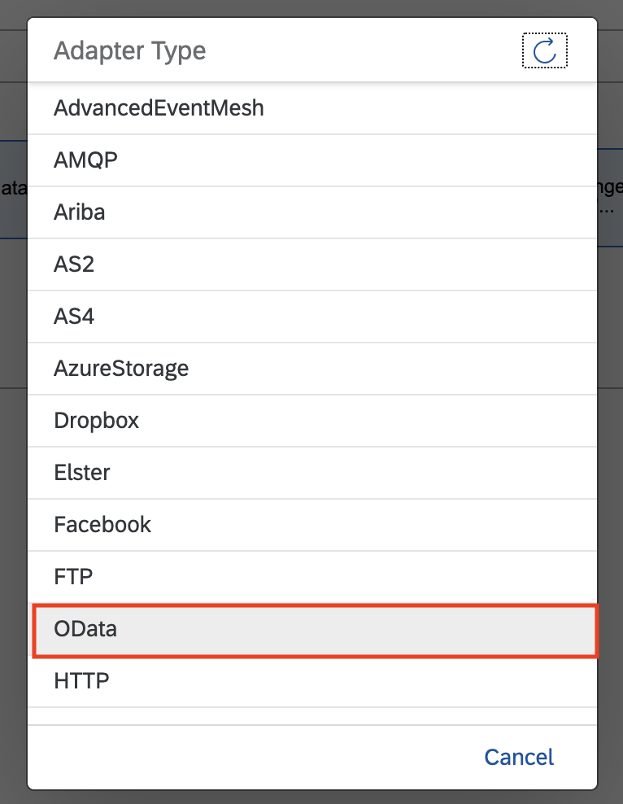

   ポップアップ画面では`Adapter Type`を設定する画面になります。ここでは`OData` → `OData V2`を選択します。

   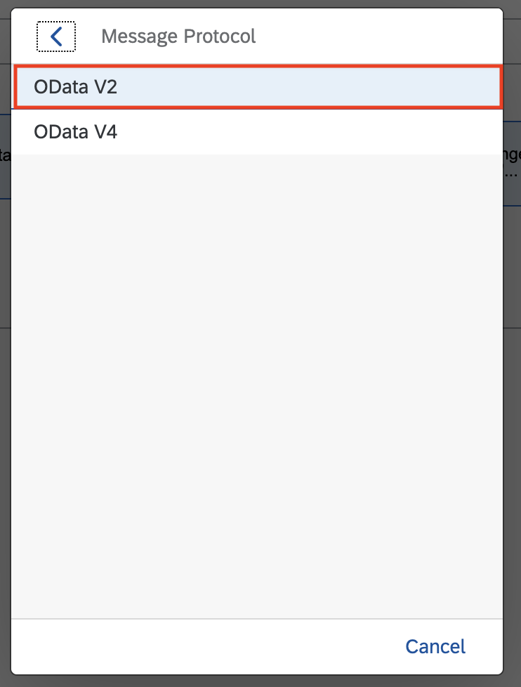

   最終的には、以下のよう`call S/4HANA with ODATA API`と`S4HANA`が接続されます。
   
   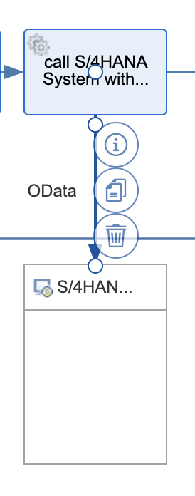

8. ### (もしもプロパティパネルが隠れている場合は)`OData`を選択したままの状態で、画面右下の`Restore`ボタンを押します。

   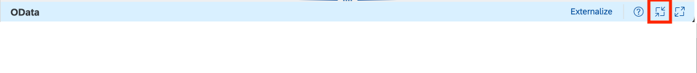

9. ### 画面下部に表示された`OData`のプロパティが表示されます。こちらの`Connection` タブに値を以下のように設定してください。

    `Connection`タブ
    |パラメータ|入力項目|
    |--|--|
    |Address:|`https://ica-jp10.apimanagement.jp10.hana.ondemand.com/v1/GWSAMPLE_BASIC` |
    |Proxy Type:|`Internet`を選択 *デフォルト|
    |Authentication:|`none`を選択 *デフォルト|
    |CSRF Protected:|`チェック` *デフォルト|
    |Reuse Connection:|`チェック` *デフォルト|
    　
    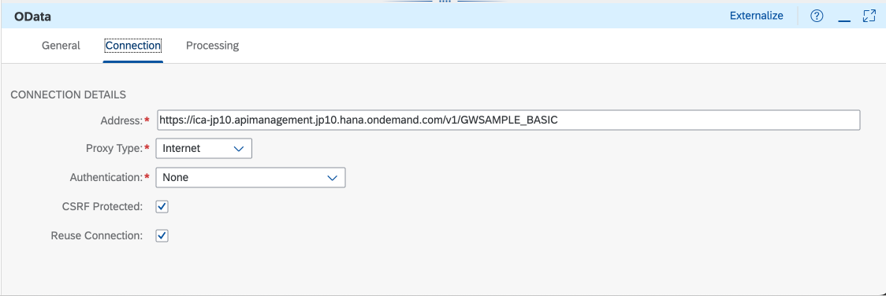

10. ### `Processing`タブを選択して、`Resource Path:`項目の右側にある`Select`ボタンを押してください。その結果、`Model Opreation`のポップアップ画面が表示されます。

    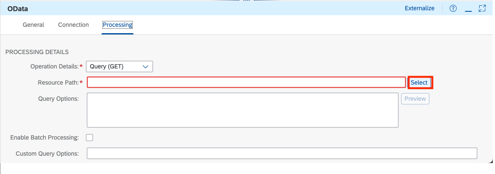

11. ### `1.Connection to System`画面では`項目はすべて変更しない`で`Step 2`ボタンを押してください。
   
    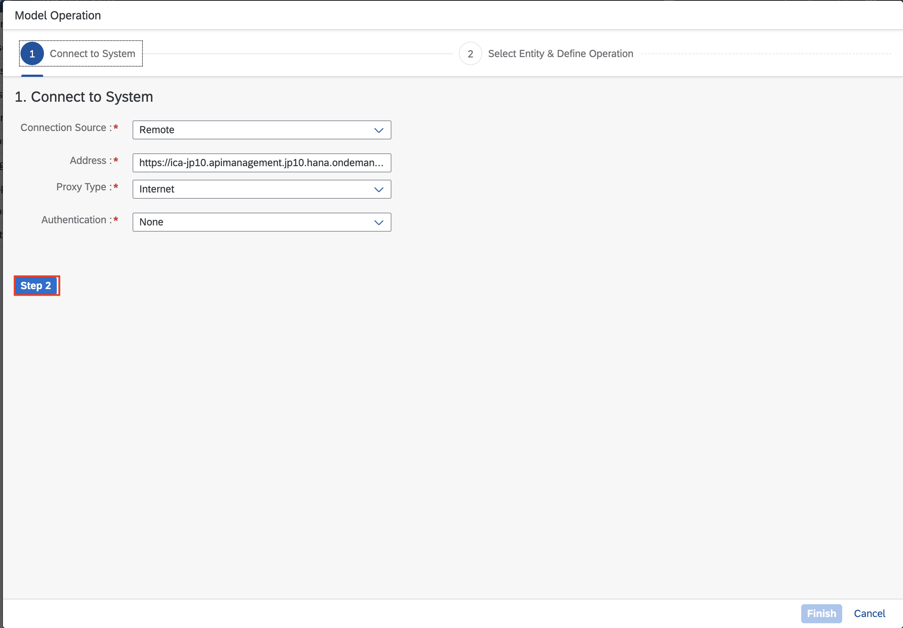

12. ### `2.Select Entity & Define Opreation`画面では、以下のようにデータを設定してください。
    
    `2.Select Entity & Define Opreation`画面
    |パラメータ|入力項目|
    |--|--|
    |Operation:|`Query (GET)`  *デフォルト|
    |Select Entity:|`ProductSet`を選択 *項目右端の虫メガネのアイコンから選択可能|
    |Fields:| `ProductID`, `Category`, `Description`, `SupplierName`, `MeasureUnit`, `CurrencyCode`, `Price`を選択 *Select Entity で`ProductSet`を選択すると選択可能になります。|

    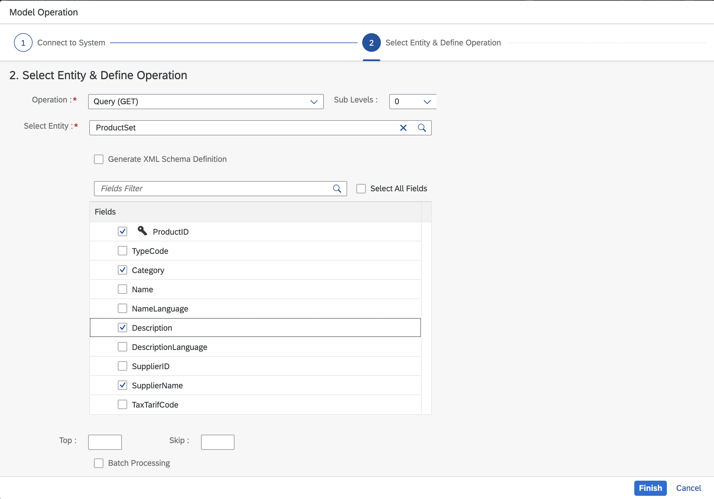
    
13. ### 画面の左下にある`Step 3`を選択します。(隠れている場合は画面をスクロールしてください。)
   
    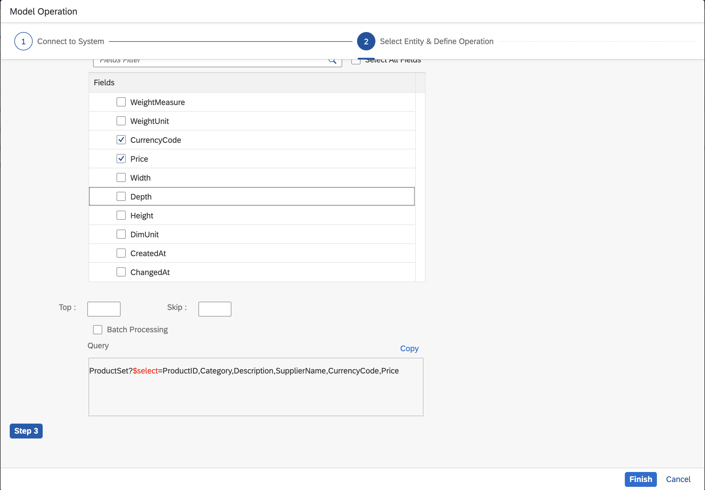

14. ### `3.Configure Filter & Sorting`画面では、以下のようにデータを設定してください。
    
    `3.Configure Filter & Sorting`画面の`Filter By`のパート
    |パラメータ|入力項目|
    |--|--|
    |一番右の項目|`ProductID`を選択 |
    |真ん中の項目|`Equal`を選択|
    |一番左の項目|`${property.ProductID}` *Exchange Property の項目`ProductID`の参照|

    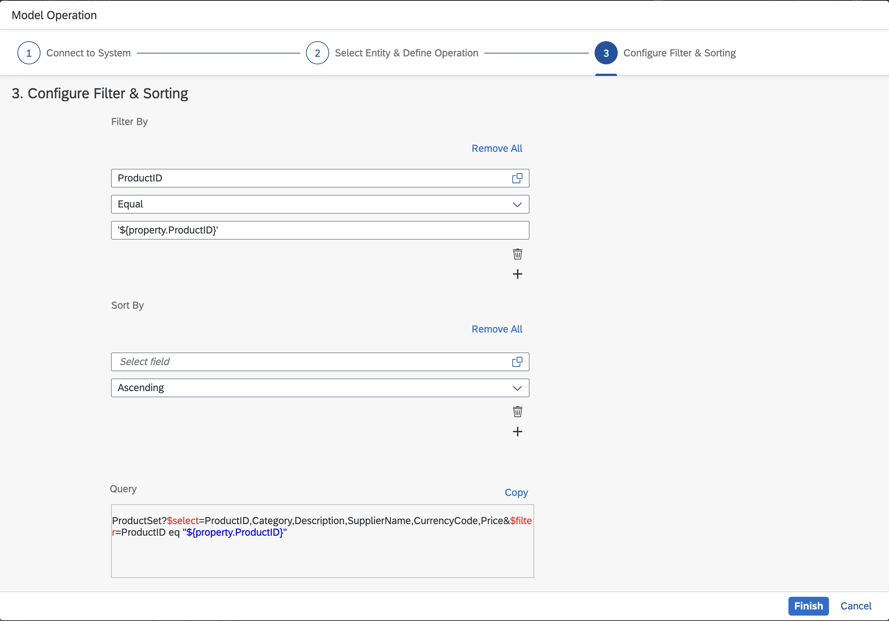

15. ### 画面の右下にある`Finish`ボタンを押してください。

    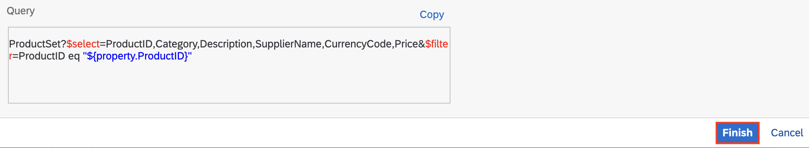

    最終的に、`Query Options`項目に以下のようなURLクエリオプションが作成されます。

    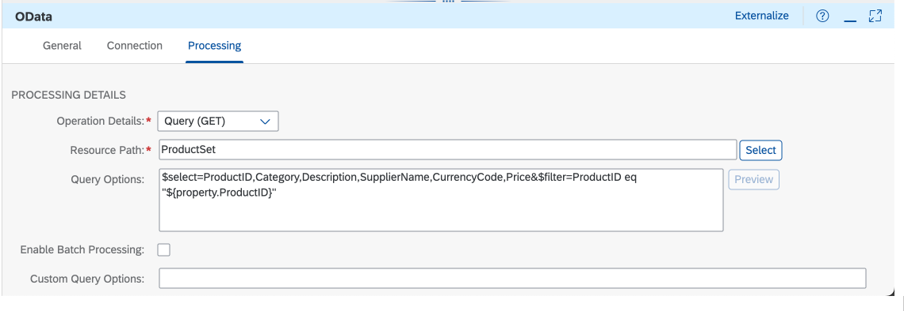

    > OData Adapterのその他のパラメータの意味などは、SAP Help の[こちら](https://help.sap.com/docs/cloud-integration/sap-cloud-integration/odata-adapter)をご確認ください。
      

16. ### 画面右上にある`Save as Version`ボタンを押して、開いたポップアップ画面のパラメータに以下のように入力した後に、`OK`ボタンを押してください。

     |パラメータ|入力項目|
     |--|--|
     |Version:|`デフォルト`のまま|
     |Comment:|`Add OData call to S/4HANA`|
     
     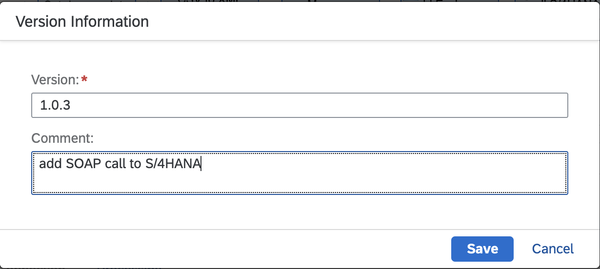
     

## ステップ3: Flow をトレース(デバック)付き実行して、プロセス終了時のMessage内のPayload にS/4HANAから取得した製品データが格納されていることを確認

内容を開く

  
1. ### (`注意:` もしも`Manage Integration Content`タブが閉じている場合のみ) Integration Flow のプロパティの`Deployment Status`タブにある項目`Deployment Status`の横にある`Navigate to Manage Integration Content`のリンクを右クリックして`新しいタブでリンクを開く`を選択して、リンク先を新しいタブで開いてください。
    
   
    
    >　上記画面はMac版のGoogle Chome のものです。  

 2. ### 開かれたManage Integration Content画面にある左のリストから作成した`Integration Flow for xx` (`xxについては講師から指定された数字に数字`)を選択してください。
    
    

 3. ### 表示された`Integration Flow for xx`の情報の最後にある`Log Configration`セクションにある`Log Level`を`info`→`Trace`に変更してください。ログレベル変更の確認のポップアップ画面が表示されますので、`Change`ボタンを押してください。その結果としてログレベルが変更された旨のメッセージが表示されます。 
    
    

    ログレベル変更確認のポップアップ画面

    
    
    ログレベル変更された旨のメッセージ表示

    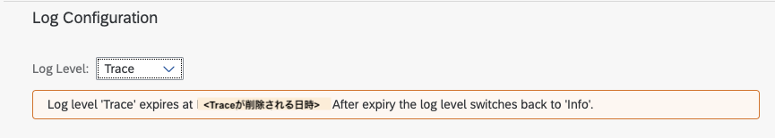

 4. ### Integration FLow のDesigner 画面のタブに戻ります。 (Manage Integration Content 画面のタブはすぐに使いますので、`閉じない`でください。)
    
    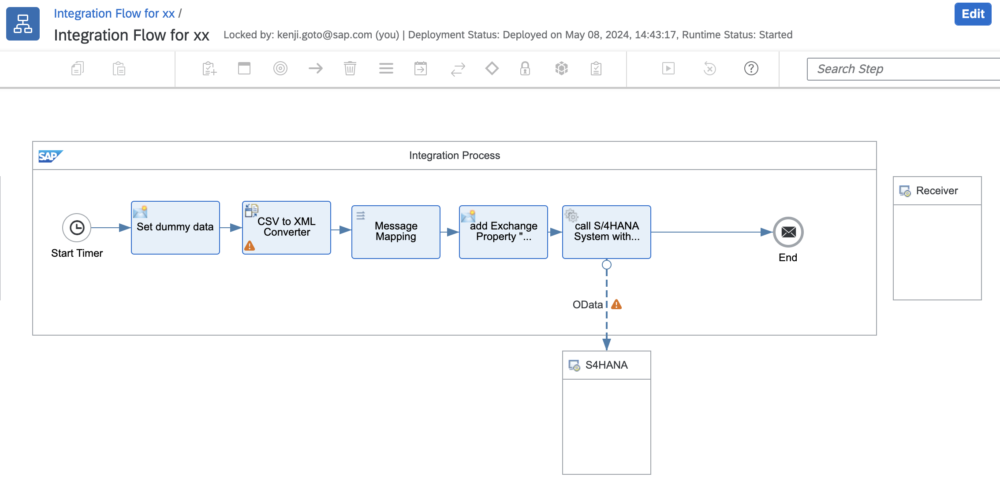
    
 5. ### (Desginer の) 画面右上にある`Deploy`ボタンを押して、作成したiFlow を再度ディプロイしてください。ポップアップ画面が開いたら、そのまま`Yes`ボタンを押してください
    
     
     
     表示されたポップアップ画面はそのまま`Yes`ボタンを押してください。その後、Triggered Deployment を表すポップアップ画面が出ますので、`OK`ボタンを押してください。

     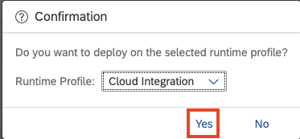
     
     Triggered Deployment を表すポップアップ画面

     
   
 6. ### Editorの空白部分(Integration Process の箱の下あたり。)を選択して、下に`Integration Flow`のプロパティが表示されます。その中にある`Deployment Status`タブを開き、以下のプロパティが、それぞれ指定の状態になっていることを確認してください。　*Deployment には少し時間がかかる場合があります。ステータスが変更されるまで、少しお待ちください。
   
     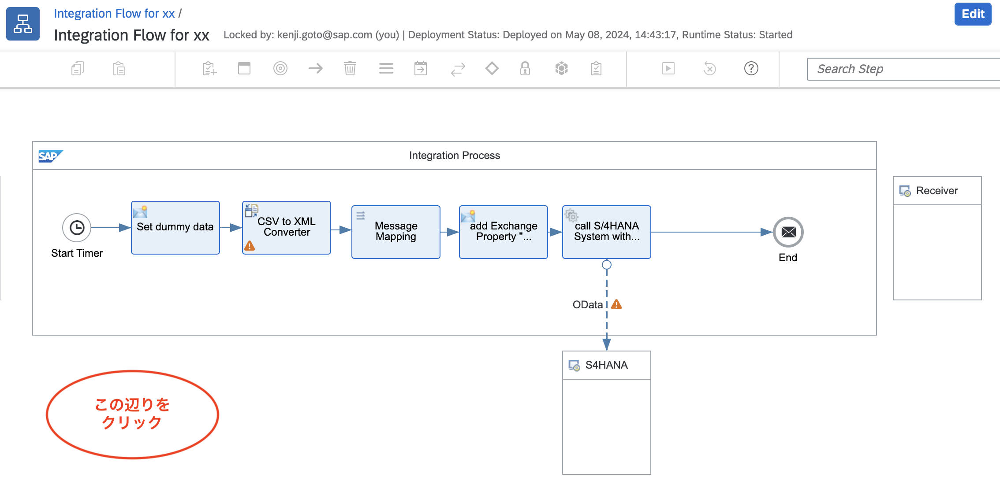
     

     `Integration Flow`のプロパティ画面

    
     
     |パラメータ|表示されるべき値|
     |--|--|
     |Deplyoment Status:|`Deployed`|
     |Runtime Status:|`Started`|
     
     上記のように表示された場合には、iFlow が開始され`トレースが記録された状態`になります。
   
 7. ### 再びManage Integration Content 画面のタブに戻り、`Integration Flow for xx`を選択して、 `Artifical Details`セクションにあるリンク`Monitor Message Processing`を押してください。
   
    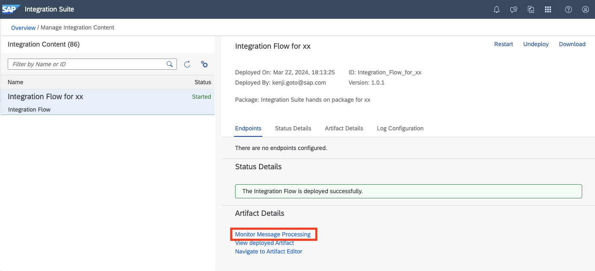
    
 8. ### その結果として、Monitor Message Processing 画面が表示されます。この画面の左側のプロセスされたメッセージの一覧がリストで表示されます。その中から`Status`が`Completed`になっているもを選択してください。(複数ある場合は、`Completed`になっているエントリーから`一番最新のもの`=一番上のものを選択してください。)
   
     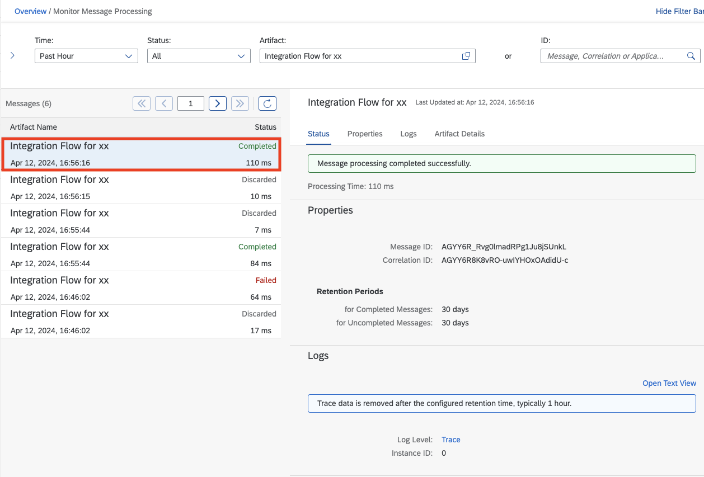

 9. ###  表示された`Integration Flow for xx`の情報の三番目にある`Log`セクションにある`Log Level`の`Trace`のリンクをクリックしてください。
    
     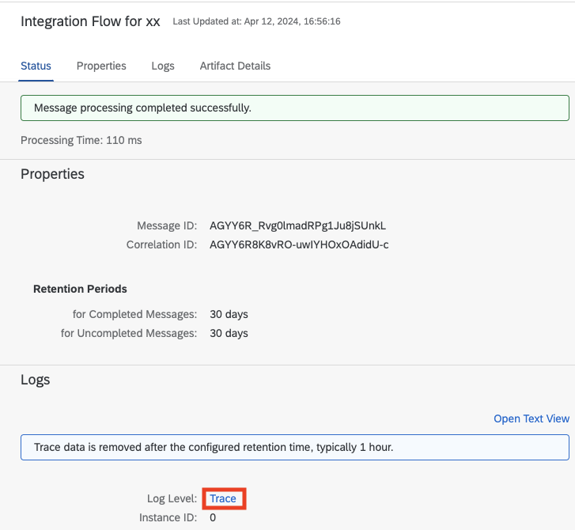

 10. ### 結果としてMessage のプロセス情報を示すMessage Processing Run 画面が表示されます。ここからトレース内容を確認ます。左のリストにある`End`を選択してください。これにより右にあるiFlow の図にあるEnd Event が強調表示されます。(これにより`End Event` が実行された直後のトレース情報を確認することができます。)

     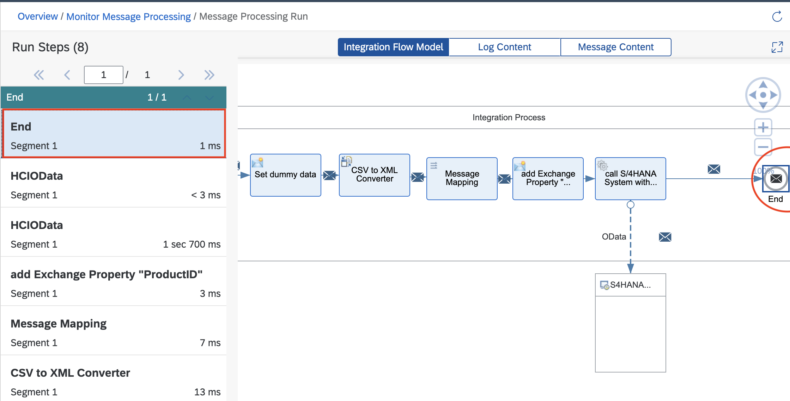
     
 11. ### iFlow の図の上にある`Message Content`(`Log COntent`の右横)を選択してください。さらに`Payload`を選択してください。`End Event` 時点での`Payload` ( = Message のBody)が表示されます。これで`S/4AHANシステムから取得した製品マスターの内容`がセットされていることが確認できました。
    
     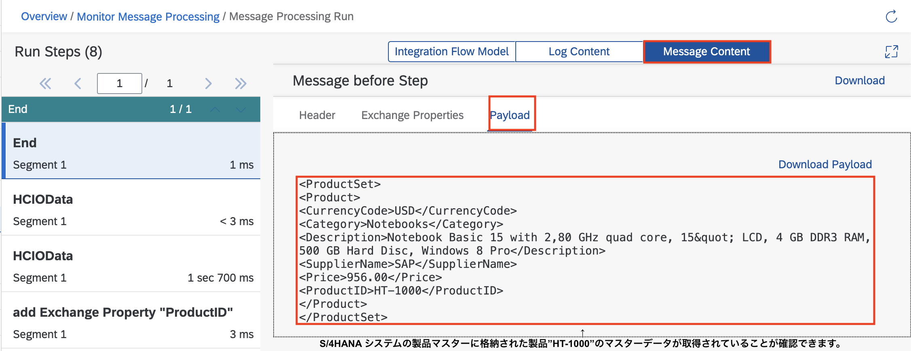

## まとめ
本演習では、S/4HANA (OData API を利用する方式)にアクセスしてデータを取得する方法を理解しました。
