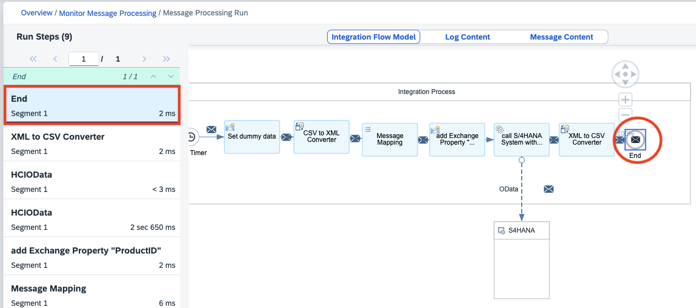

# 演習6: データ出力のデータフォーマットの変換

## 目的
本演習ではiFlow からS/4HANAシステムから取得した製品データのデータ形式を変換します。こちらではIntegration Suite に組み込まれている`XML to CSV Converter`を利用します。具体的には以下の内容を実施します。
1. Converter 機能を利用してXML形式のデータをCSV形式にデータ変換
2. iFlow をトレース(デバック)付き実行して、プロセス終了時のMessage内のPayload にS/4HANAから取得した製品データがCSV形式に変換されていることを確認

>本演習で作成したiFlow は次のようなステップで実行されます。
>1. ディプロイ時にタイマーでプロセス開始
>2. プロセス内部でダミーのCSV形式データを設定
>3. ダミーデータをCSV形式からXML形式に変換
>4. Message 内部でデータをマッピングして、異なる項目にデータをマッピング(例: 項目ProductIdentifierから項目ProductIDへ)
>5. Payload 内のProductIDを取得してExchange Property として設定
>6. Exchange Property として設定したProductIDを利用して、この製品に関するデータをS/4HANAシステムからODataを利用して取得
>7. S/4HANAシステムから取得した製品データをMessage内のPayload に格納しプロセスを終了
>8. `S/4HANAから取得したデータをXML形式からCSV形式に変換` *
>   
>*本演習で拡張した結果として追加もしくは変更されたステップ

## 手順
## ステップ1: Converter 機能を利用してXML形式のデータをCSV形式にデータ変換

内容を開く

  1. ### Integration Flow のDesigner 画面のタブに戻ります。そしてIntegration Flow のEditor画面の右上にある`Edit`ボタンを押して、編集モードに変更してください。
    
     
     
  2. ### ### メニューにある`Transformation`の中から`Converter`→`XML to CSV Converteer`を選択して、Integration Flow 内の`call S/4HANA System with ODATA API`とEnd を結ぶ線上に配置してください。
     
     
     以下、`XML to CSV Converter`を選択して, Integration Process 内の`call S/4HANA System with ODATA API` とEnd を結ぶ線上に配置した状態

     
   
  3. ### (もしもプロパティパネルが隠れている場合は)`XML to CSV COnverter`を選択したままの状態で、画面右下の`Restore`ボタンを押します。
    
     
     
  4. 画面下部に表示された`XML to CSV Converter`のプロパティが表示されます。こちらの`General` タブおよび`Exchange Property` タブの値を以下のように設定してください。
    
     `General`タブ
     |パラメータ|入力項目|
     |--|--|
     |Name:|`XML to CSV Converter`|

     
     
     `Processing`タブ
     |パラメータ|入力項目|
     |--|--|
     |Path to Source Element in XSD:|`/ProductSet/Product`|
     |Feild Separator in CSV:|`Comma(,)` *デフォルトのまま|
     |Include Field Name as Headers:|`チェック`|
     |Include Parent Element:|`空白` *デフォルトのまま|
     |Include Attribute Values:|`空白`  *デフォルトのまま|

     
     
     >Content Modifier のその他のパラメータの意味などは、SAP Help の[こちら](https://help.sap.com/docs/cloud-integration/sap-cloud-integration/configure-xml-to-csv-converter)をご確認ください。
     
  7. ### ### 画面右上にある`Save as Version`ボタンを押して、開いたポップアップ画面のパラメータに以下のように入力した後に、`OK`ボタンを押してください。

     |パラメータ|入力項目|
     |--|--|
     |Version:|`デフォルト`のまま|
     |Comment:|`Add XML to CSV Converter`|
     
     

## ステップ2:  iFlow をトレース(デバック)付き実行して、プロセス終了時のMessage内のPayload にS/4HANAから取得した製品データがCSV形式に変換されていることを確認

内容を開く

 
1. ### (`注意:` もしも`Manage Integration Content`タブが閉じている場合のみ) Integration Flow のプロパティの`Deployment Status`タブにある項目`Deployment Status`の横にある`Navigate to Manage Integration Content`のリンクを右クリックして`新しいタブでリンクを開く`を選択して、リンク先を新しいタブで開いてください。
    
   
    
    >　上記画面はMac版のGoogle Chome のものです。  

 2. ### 開かれたManage Integration Content画面にある左のリストから作成した`Integration Flow for xx` (`xxについては講師から指定された数字に数字`)を選択してください。
    
    

 3. ### 表示された`Integration Flow for xx`の情報の最後にある`Log Configration`セクションにある`Log Level`を`info`→`Trace`に変更してください。ログレベル変更の確認のポップアップ画面が表示されますので、`Change`ボタンを押してください。その結果としてログレベルが変更された旨のメッセージが表示されます。 
    
    

    ログレベル変更確認のポップアップ画面

    
    
    ログレベル変更された旨のメッセージ表示

    

 4. ### Integration FLow のDesigner 画面のタブに戻ります。 (Manage Integration Content 画面のタブはすぐに使いますので、`閉じない`でください。)
    
    
    
 5. ### (Desginer の) 画面右上にある`Deploy`ボタンを押して、作成したiFlow を再度ディプロイしてください。ポップアップ画面が開いたら、そのまま`Yes`ボタンを押してください
    
     
     
     表示されたポップアップ画面はそのまま`Yes`ボタンを押してください。その後、Triggered Deployment を表すポップアップ画面が出ますので、`OK`ボタンを押してください。

     
     
     Triggered Deployment を表すポップアップ画面

     
   
 6. ### Editorの空白部分(Integration Process の箱の下あたり。)を選択して、下に`Integration Flow`のプロパティが表示されます。その中にある`Deployment Status`タブを開き、以下のプロパティが、それぞれ指定の状態になっていることを確認してください。　*Deployment には少し時間がかかる場合があります。ステータスが変更されるまで、少しお待ちください。
   
     
     

     `Integration Flow`のプロパティ画面

    
     
     |パラメータ|表示されるべき値|
     |--|--|
     |Deplyoment Status:|`Deployed`|
     |Runtime Status:|`Started`|
     
     上記のように表示された場合には、iFlow が開始され`トレースが記録された状態`になります。
   
 7. ### 再びManage Integration Content 画面のタブに戻り、`Integration Flow for xx`を選択して、 `Artifical Details`セクションにあるリンク`Monitor Message Processing`を押してください。
   
    
    
 8. ### その結果として、Monitor Message Processing 画面が表示されます。この画面の左側のプロセスされたメッセージの一覧がリストで表示されます。その中から`Status`が`Completed`になっているもを選択してください。(複数ある場合は、`Completed`になっているエントリーから`一番最新のもの`=一番上のものを選択してください。)
   
     

 9. ###  表示された`Integration Flow for xx`の情報の三番目にある`Log`セクションにある`Log Level`の`Trace`のリンクをクリックしてください。
    
     

 10. ### 結果としてMessage のプロセス情報を示すMessage Processing Run 画面が表示されます。ここからトレース内容を確認ます。左のリストにある`End`を選択してください。これにより右にあるiFlow の図にあるEnd Event が強調表示されます。(これにより`End Event` が実行された直後のトレース情報を確認することができます。)

     
     
 11. ### iFlow の図の上にある`Message Content`(`Log COntent`の右横)を選択してください。さらに`Payload`を選択してください。`End Event` 時点での`Payload` ( = Message のBody)が表示されます。これでダミーで設定したCSVファイルの内容が、`XML`形式に変換されてセットされていることが確認できました。
    
     

## まとめ
本演習では、S/4HANAから取得したデータの形式をXML形式からCSV形式に変換する方法を実装いただきました。
