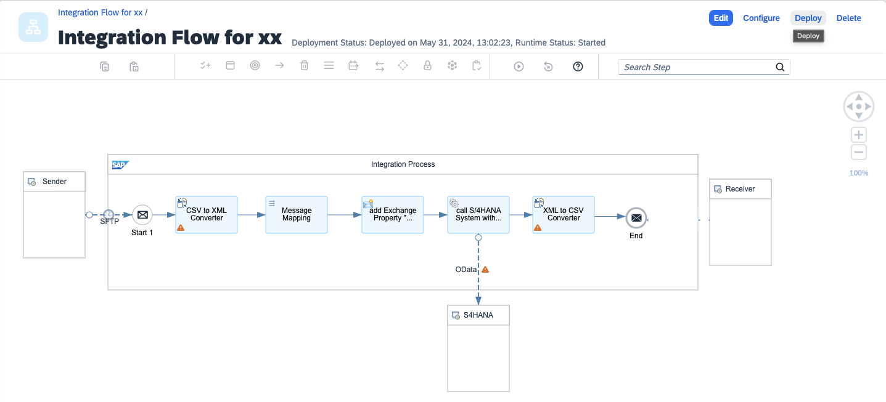

# 演習7: SFTPアダプターを用いたファイルポーリングによるプロセス実行への変更

## 目的
これまでの演習では効率の観点から、iFlow をDeploy したタイミングでタイマーを用いた即時実行を行ってきました。本演習ではより実践的に、クラウド上のSFTPサービスに特定のファイルが格納されたタイミングでプロセスを実行する方法に変更します。こちらではIntegration Suite の持つSFTP Sender Adapter の機能を利用します。具体的には以下の内容を実施します。
1. Content Converter `set dummy data`([演習3, ステップ2で実装](https://github.com/goto510ken/SAPIntegrationSuite_HandsOn/tree/main/ex3#%E3%83%A1%E3%83%8B%E3%83%A5%E3%83%BC%E3%81%8B%E3%82%89%E7%B7%A8%E9%9B%86%E3%83%A1%E3%83%8B%E3%83%A5%E3%83%BC%E3%81%AB%E3%81%82%E3%82%8Btransformation%E3%81%AE%E4%B8%AD%E3%81%8B%E3%82%89content-modifier%E3%82%A4%E3%83%99%E3%83%B3%E3%83%88%E3%82%92%E9%81%B8%E6%8A%9E%E3%81%97%E3%81%A6integration-prcess-%E5%86%85%E3%81%AE-time-start-%E3%81%A8end-%E3%82%92%E7%B5%90%E3%81%B6%E7%B7%9A%E4%B8%8A%E3%81%AB%E9%85%8D%E7%BD%AE%E3%81%97%E3%81%A6%E3%81%8F%E3%81%A0%E3%81%95%E3%81%84))の削除
2. Event `Timer`([演習3, ステップ2で実装](https://github.com/goto510ken/SAPIntegrationSuite_HandsOn/tree/main/ex3#%E3%83%A1%E3%83%8B%E3%83%A5%E3%83%BC%E3%81%8B%E3%82%89%E7%B7%A8%E9%9B%86%E3%83%A1%E3%83%8B%E3%83%A5%E3%83%BC%E3%81%AB%E3%81%82%E3%82%8Bevent%E3%81%AE%E4%B8%AD%E3%81%8B%E3%82%89timer%E3%82%A4%E3%83%99%E3%83%B3%E3%83%88%E3%82%92%E9%81%B8%E6%8A%9E%E3%81%97%E3%81%A6integration-prcess-%E5%86%85%E3%81%AE-start-%E3%81%A8end-%E3%82%92%E7%B5%90%E3%81%B6%E7%B7%9A%E4%B8%8A%E3%81%AB%E9%85%8D%E7%BD%AE%E3%81%97%E3%81%A6%E3%81%8F%E3%81%A0%E3%81%95%E3%81%84-timer%E3%82%A4%E3%83%99%E3%83%B3%E3%83%88%E3%81%AF%E4%B8%80%E7%95%AA%E4%B8%8B%E3%81%AB%E3%81%82%E3%82%8B%E3%81%AE%E3%81%A7%E8%A6%8B%E3%81%A4%E3%81%8B%E3%82%89%E3%81%AA%E3%82%89%E5%A0%B4%E5%90%88%E3%81%AFevent%E8%87%AA%E4%BD%93%E3%82%92%E3%82%B9%E3%82%AF%E3%83%AD%E3%83%BC%E3%83%AB%E3%81%99%E3%82%8B%E3%81%A8%E8%A1%A8%E7%A4%BA%E3%81%95%E3%82%8C%E3%81%BE%E3%81%99))を削除して、Event `Start Message`への置き換え
3. SFTP Sender Adopter の実装
4. ディプロイおよびトレースの準備
5. SFTPサーバーへファイルを格納してプロセスの確認

   

>本演習で作成したiFlow は次のようなステップで実行されます。
>1. `ディプロイ後にSFTPサーバーにCSVファイルをアップロード` *
>2. `SFTP Sender Adopter がSFTP を一定間隔でポーリングし、ファイルの存在があればプロセスを開始` *
>3. `ファイルからのデータをCSV形式からXML形式に変換` *
>4. Message 内部でデータをマッピングして、異なる項目にデータをマッピング(例: 項目ProductIdentifierから項目ProductIDへ)
>5. Payload 内のProductIDを取得してExchange Property として設定
>6. Exchange Property として設定したProductIDを利用して、この製品に関するデータをS/4HANAシステムからODataを利用して取得
>7. S/4HANAシステムから取得した製品データをMessage内のPayload に格納しプロセスを終了
>8. S/4HANAから取得したデータをXML形式からCSV形式に変換
>   
>*本演習で拡張した結果として追加もしくは変更されたステップ

   
