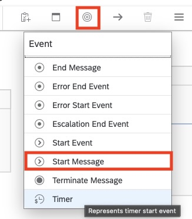
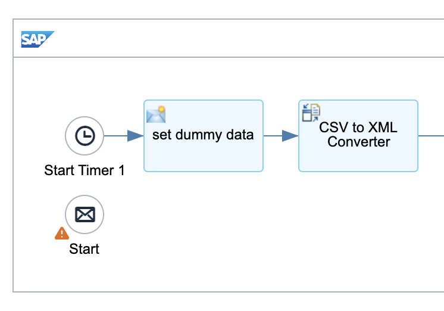
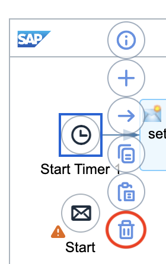
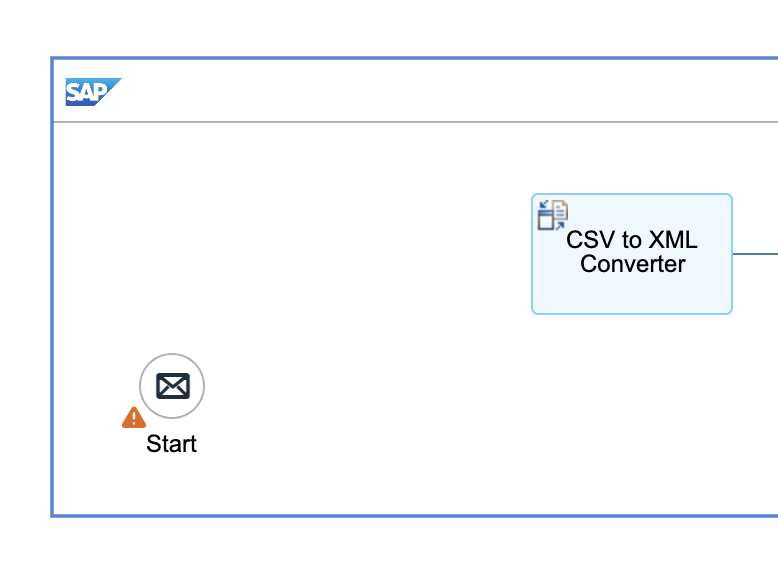
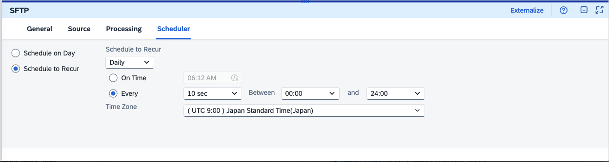
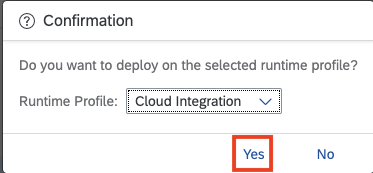
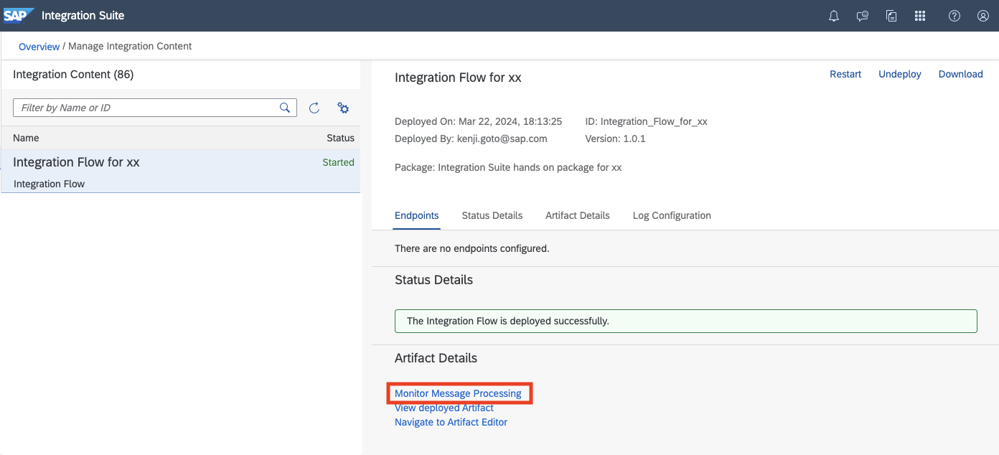

# 演習7: SFTPアダプターを用いたファイルポーリングによるプロセス実行への変更

## 目的
これまでの演習では効率の観点から、iFlow をDeploy したタイミングでタイマーを用いた即時実行を行ってきました。本演習ではより実践的に、クラウド上のSFTPサービスに特定のファイルが格納されたタイミングでプロセスを実行する方法に変更します。こちらではIntegration Suite の持つSFTP Sender Adapter の機能を利用します。具体的には以下の内容を実施します。
1. 既存のiFlowの変更
   1. Event `Timer`([演習3, ステップ2で実装](https://github.com/goto510ken/SAPIntegrationSuite_HandsOn/tree/main/ex3#%E3%83%A1%E3%83%8B%E3%83%A5%E3%83%BC%E3%81%8B%E3%82%89%E7%B7%A8%E9%9B%86%E3%83%A1%E3%83%8B%E3%83%A5%E3%83%BC%E3%81%AB%E3%81%82%E3%82%8Bevent%E3%81%AE%E4%B8%AD%E3%81%8B%E3%82%89timer%E3%82%A4%E3%83%99%E3%83%B3%E3%83%88%E3%82%92%E9%81%B8%E6%8A%9E%E3%81%97%E3%81%A6integration-prcess-%E5%86%85%E3%81%AE-start-%E3%81%A8end-%E3%82%92%E7%B5%90%E3%81%B6%E7%B7%9A%E4%B8%8A%E3%81%AB%E9%85%8D%E7%BD%AE%E3%81%97%E3%81%A6%E3%81%8F%E3%81%A0%E3%81%95%E3%81%84-timer%E3%82%A4%E3%83%99%E3%83%B3%E3%83%88%E3%81%AF%E4%B8%80%E7%95%AA%E4%B8%8B%E3%81%AB%E3%81%82%E3%82%8B%E3%81%AE%E3%81%A7%E8%A6%8B%E3%81%A4%E3%81%8B%E3%82%89%E3%81%AA%E3%82%89%E5%A0%B4%E5%90%88%E3%81%AFevent%E8%87%AA%E4%BD%93%E3%82%92%E3%82%B9%E3%82%AF%E3%83%AD%E3%83%BC%E3%83%AB%E3%81%99%E3%82%8B%E3%81%A8%E8%A1%A8%E7%A4%BA%E3%81%95%E3%82%8C%E3%81%BE%E3%81%99))を削除して、Event `Start Message`への置き換え
   2. Content Converter `set dummy data`([演習3, ステップ2で実装](https://github.com/goto510ken/SAPIntegrationSuite_HandsOn/tree/main/ex3#%E3%83%A1%E3%83%8B%E3%83%A5%E3%83%BC%E3%81%8B%E3%82%89%E7%B7%A8%E9%9B%86%E3%83%A1%E3%83%8B%E3%83%A5%E3%83%BC%E3%81%AB%E3%81%82%E3%82%8Btransformation%E3%81%AE%E4%B8%AD%E3%81%8B%E3%82%89content-modifier%E3%82%A4%E3%83%99%E3%83%B3%E3%83%88%E3%82%92%E9%81%B8%E6%8A%9E%E3%81%97%E3%81%A6integration-prcess-%E5%86%85%E3%81%AE-time-start-%E3%81%A8end-%E3%82%92%E7%B5%90%E3%81%B6%E7%B7%9A%E4%B8%8A%E3%81%AB%E9%85%8D%E7%BD%AE%E3%81%97%E3%81%A6%E3%81%8F%E3%81%A0%E3%81%95%E3%81%84))の削除
2. SFTP Sender Adapter の実装
3. トレースの準備およびディプロイ
4. SFTPサーバーへファイルを格納してプロセスの確認

   

>本演習で作成したiFlow は次のようなステップで実行されます。
>1. `ディプロイ後にSFTPサーバーにCSVファイルをアップロード` *
>2. `SFTP Sender Adapter がSFTP を一定間隔でポーリングし、ファイルの存在があればプロセスを開始` *
>3. `ファイルからのデータをCSV形式からXML形式に変換` *
>4. Message 内部でデータをマッピングして、異なる項目にデータをマッピング(例: 項目ProductIdentifierから項目ProductIDへ)
>5. Payload 内のProductIDを取得してExchange Property として設定
>6. Exchange Property として設定したProductIDを利用して、この製品に関するデータをS/4HANAシステムからODataを利用して取得
>7. S/4HANAシステムから取得した製品データをMessage内のPayload に格納しプロセスを終了
>8. S/4HANAから取得したデータをXML形式からCSV形式に変換
>   
>*本演習で拡張した結果として追加もしくは変更されたステップ

## 手順
## ステップ1: 既存のiFlowの変更

内容を開く

1. ### `Integration Suite` のDesigner 画面のタブに戻ります。そしてIntegration Flow のEditor画面の右上にある`Edit`ボタンを押して、編集モードに変更してください。
    
     
     
2. ### メニューにある`Event`の中から`Start Message`を選択して、Integration Flow 内の`Timeer`の`Start Timer 1`の下あたりに配置します。
  
   
   
   以下、Start Message `Start 1`がTimer `Start Timer 1`の下あたりに配置された状態

   
   
3. ### `Timeer`の`Start Timer 1`のメニューから`Deleteを選択して削除します。
  
   

   以下、Timer`Start Timer 1`が削除された状態

   

4. ### Integration Flow上の Content Converter `set dummy dummy`を選択してメニューから`Delete`を選択して削除してください。    

   

   以下、`set dummy data`が削除された状態
   
   

5. ### Start Message `Start 1`を選択して、`Connector`を選択してContent Modifier `CSV to XML Converter`に接続してください。

   

   以下、Start Message `Start 1`をContent Modifier `CSV to XML Converter`に接続された状態(レイアウト調整済み。) 
   
   
  
6. ### 画面右上にある`Save`ボタンを押して、作成したものを保存してください。
  
   

   
## ステップ2: SFTP Sender Adapter の実装

内容を開く

1. ### iFlow 上の左端にある`Sender`の`Connector`を選択してStart Message `Sart 1`に接続してください。
  
   

   接続された状態で以下のようになり、ポップアップ画面が開きます。ここで`SFTP`を選択します。

    

   最終的には、以下のように`Sender`とStart Message `Strat 1`が接続されます。

   
   
2. ### (もしもプロパティパネルが隠れている場合は)`SFTP`を選択したままの状態で、画面右下の`Restore`ボタンを押します。
   
   
   
3. ### 画面下部に表示された`SFTP`のプロパティが表示されます。こちらの`Source`タブおよび`Scheduler`タブの値を以下のようにせってしてください。    

   `Source`タブ
   |パラメータ|入力項目|
   |--|--|
   |Directory:|`/HandsOn/In`|
   |File Name:|`Product_xx.csv` *`xx`については講師から`指定された数字に置き換え`てください。SFTPサーバーでは一つのユーザーを共有しますので`必ずxx部分を正しく記載`してください。もしも行わない場合は、`他の受講者と競合が発生`する可能があります。|
   |Address:|講師より共有されたSFTPサーバーの`IPアドレス`を参照してください。|
   |Proxy Type:|`Internet`を選択 *デフォルトのまま|
   |Authentication:|`Public Key`を選択|
   |User Name:|`sftpuser`|
   |Private Key Alias|`sftpuser_ssh_key` ([演習2, スッテプ1で実装](https://github.com/goto510ken/SAPIntegrationSuite_HandsOn/tree/main/ex2#%E3%83%AA%E3%82%B9%E3%83%88%E3%81%AE%E5%8F%B3%E4%B8%8A%E3%81%AB%E3%81%82%E3%82%8Badd-ssh-key%E3%82%92%E9%81%B8%E6%8A%9E%E3%81%97%E3%81%A6%E3%81%8F%E3%81%A0%E3%81%95%E3%81%84))|
   |Time Out:|`10000` *デフォルトのまま|
   |Maxmum Reconnect Attempts:|`3` *デフォルトのまま|
   |Reconnect Delay (in ms):|`1000` *デフォルトのまま|
   |Automatically Disconnect:|`空白` *デフォルトのまま|
   |Enable Support for Deprecated Algorithms: |`空白` *デフォルトのまま|
   
   
   
   `Scheduler`タブ
   |パラメータ|入力項目|
   |--|--|
   |(チェックボックス)Schedule to Recur:|`選択` *デフォルトのまま|
   |Schedule to Recur:|`Daily`を選択 *デフォルトのまま|
   |(チェックボックス)Every:|`10 Sec`を選択 *デフォルトのまま|
   |Between:|`00:00`を選択　*デフォルトのまま|
   |and|`24:00`を選択 *デフォルトのまま|
   |Time Zone|`(UTC 9:00) Japan Standard Time(Japan)`を選択|

   

   >SFTP Sender Adapterのその他のパラメータの意味などは、SAP Help の[こちら](https://help.sap.com/docs/cloud-integration/sap-cloud-integration/configure-sftp-sender-adapter)をご確認ください。

4. ### 画面右上にある`Save as Version`ボタンを押して、開いたポップアップ画面のパラメータに以下のように入力した後に、`OK`ボタンを押してください。

   

     |パラメータ|入力項目|
     |--|--|
     |Version:|`デフォルト`のまま|
     |Comment:|`Add Sender via SFTP`|

   

## ステップ3: トレースの準備およびディプロイ

内容を開く

   1. ### (`注意:` もしも`Manage Integration Content`タブが閉じている場合のみ) Integration Flow のプロパティの`Deployment Status`タブにある項目`Deployment Status`の横にある`Navigate to Manage Integration Content`のリンクを右クリックして`新しいタブでリンクを開く`を選択して、リンク先を新しいタブで開いてください。
     
      
      
      >　上記画面はMac版のGoogle Chome のものです。  
 
   2. ### 開かれたManage Integration Content画面にある左のリストから作成した`Integration Flow for xx` (`xxについては講師から指定された数字に数字`)を選択してください。
     
      

  3. ### 表示された`Integration Flow for xx`の情報の最後にある`Log Configration`セクションにある`Log Level`を`info`→`Trace`に変更してください。ログレベル変更の確認のポップアップ画面が表示されますので、`Change`ボタンを押してください。その結果としてログレベルが変更された旨のメッセージが表示されます。
    
     
     
     ログレベル変更確認のポップアップ画面

     
     
     ログレベル変更された旨のメッセージ表示

     

 4. ### Integration FLow のDesigner 画面のタブに戻ります。 (Manage Integration Content 画面のタブはすぐに使いますので、`閉じない`でください。)
   
    
    
 5. ### (Desginer の) 画面右上にある`Deploy`ボタンを押して、作成したiFlow を再度ディプロイしてください。ポップアップ画面が開いたら、そのまま`Yes`ボタンを押してください
    
     
     
     表示されたポップアップ画面はそのまま`Yes`ボタンを押してください。その後、Triggered Deployment を表すポップアップ画面が出ますので、`OK`ボタンを押してください。

     
     
     Triggered Deployment を表すポップアップ画面

     
   
 6. ### Editorの空白部分(Integration Process の箱の下あたり。)を選択して、下に`Integration Flow`のプロパティが表示されます。その中にある`Deployment Status`タブを開き、以下のプロパティが、それぞれ指定の状態になっていることを確認してください。　*Deployment には少し時間がかかる場合があります。ステータスが変更されるまで、少しお待ちください。
   
     
     

     `Integration Flow`のプロパティ画面

    
     
     |パラメータ|表示されるべき値|
     |--|--|
     |Deplyoment Status:|`Deployed`|
     |Runtime Status:|`Started`|
     
     上記のように表示された場合には、iFlow が開始され`トレースが記録された状態`になります。

## ステップ4: SFTPサーバーへファイルを格納してプロセスの確認

内容を開く

1. ### プロセスを起動するためにSFTPサーバーにデータを格納します。本演習ではPC上のCLI(Command Line Interface)を用いて行います。(Windows の場合は`Command Prompt` や`Power Shell`、Macの場合は`Terminal`をご利用ください。)以下の要領でファイルをSFTPサーバーにアップロードしてください。
   |ステップ|作業内容|コマンド例
   |--|--|--|
   |①|`Product_xx.csvファイルのあるローカルPCの作業フォルダ`に移動。|`cd <Product_xx.csvファイルのあるローカルPCの作業フォルダ>`|
   |②|sftpコマンドでクラウド上のSFTPサーバーにアクセス。|`sftp -i <sftp_sftpuser.pemファイル> sftpuser@<講師より共有されたSFTPサーバーのアドレス>`|
   |③|SFTPサーバーにアクセス後、サーバー内の`/HandsOn/In`フォルダに移動。|`cd /HandsOn/In`|
   |④|putコマンドでローカルのCSVファイルをSFTPサーバーへアップロード。|`put Product_xx.csv` *`xx`については講師から`指定された数字に数字に置き換え`てください。SFTPサーバーでは一つのユーザーを共有しますので`必ずxx部分を正しく記載`してください。もしも行わない場合は、`他の受講者と競合が発生`する可能があります。|
   |⑤|SFTPサーバーにCSVファイルがアップロードされたかを確認。|`ls`|
   |⑥|SFTPサーバーへのアクセスを終了する。|`bye`|

   以下サンプルではMac のTerminal を利用していますが、利用するコマンド等は基本的にどのツールでも同じです。

   

2. ### 再びIntegration Suite の Manage Integration Content 画面のタブに戻り、`Integration Flow for xx`を選択して、 `Artifical Details`セクションにあるリンク`Monitor Message Processing`を押してください。
   
    
    
 3. ### その結果として、Monitor Message Processing 画面が表示されます。この画面の左側のプロセスされたメッセージの一覧がリストで表示されます。その中から`Status`が`Completed`になっているもを選択してください。(複数ある場合は、`Completed`になっているエントリーから`一番最新のもの`=一番上のものを選択してください。)
   
     

 4. ###  表示された`Integration Flow for xx`の情報の三番目にある`Logs`セクションにある`Log Level`の`Trace`のリンクをクリックしてください。
    
     

 5. ### 結果としてMessage のプロセス情報を示すMessage Processing Run 画面が表示されます。ここからトレース内容を確認ます。左のリストにある`CSV to XML Converter`を選択してください。その上でiFlow の図の上にある`Message Content`(`Log Content`の右横)を選択してください。さらに`Payload`を選択してください。`End Event` 時点での`Payload` ( = Message のBody)が表示されます。こちらを確認するとProduct_xx.csvのデータが読み込まれていることが確認できます。

     

## まとめ
本演習では、プロセス連携をSFTPサーバーに格納したCSVファイルを検知して自動的に開始する方法を学習いただきました。
