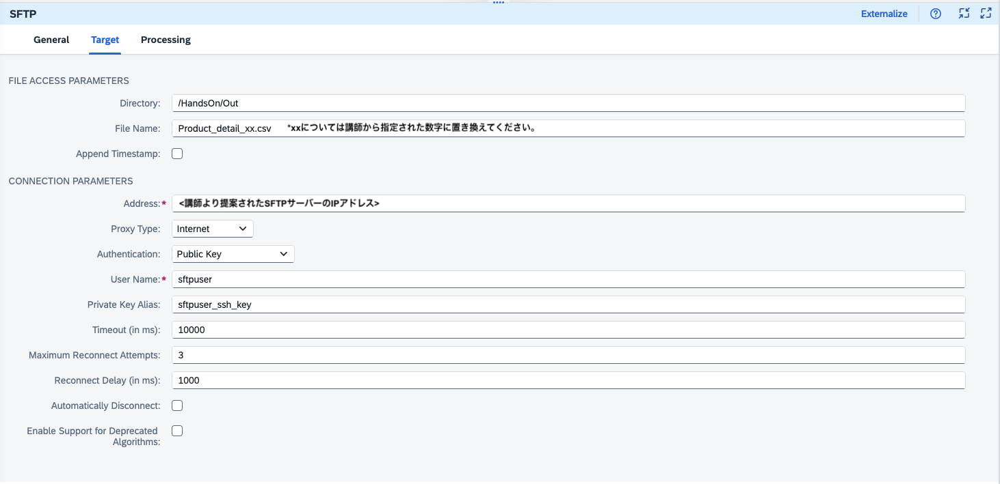

# 演習8: SFTPアダプターの利用によるファイル出力への変更

## 目的
iFlow の構築の総仕上げとして、出力データをCSVファイルとしてSFTPサーバーに出力します。こちらではIntegration Suite の持つSFTP Receiver Adapter の機能を利用します。具体的には以下の内容を実施します。
1. SFTP Receiver Adapter の実装
2. トレースの準備およびディプロイ
3. プロセスの実施とプロセス結果の確認

>本演習で作成したiFlow は次のようなステップで実行されます。
>1. ディプロイ後にSFTPサーバーにCSVファイルをアップロード
>2. SFTP Sender Adapter がSFTP を一定間隔でポーリングし、ファイルの存在があればプロセスを開始
>3. ファイルからのデータをCSV形式からXML形式に変換
>4. Message 内部でデータをマッピングして、異なる項目にデータをマッピング(例: 項目ProductIdentifierから項目ProductIDへ)
>5. Payload 内のProductIDを取得してExchange Property として設定
>6. Exchange Property として設定したProductIDを利用して、この製品に関するデータをS/4HANAシステムからODataを利用して取得
>7. S/4HANAシステムから取得した製品データをMessage内のPayload に格納しプロセスを終了
>8. S/4HANAから取得したデータをXML形式からCSV形式に変換
>9. `SFTPサーバーに出力されたCSVファイルの確認`*
>   
>*本演習で拡張した結果として追加もしくは変更されたステップ

## 手順
## ステップ1:  SFTP Reciever Adapter の実装

内容を開く

1. ### `Integration Suite` のDesigner 画面のタブに戻ります。そしてIntegration Flow のEditor画面の右上にある`Edit`ボタンを押して、編集モードに変更してください。
    
     
     
2. ### iFlow 上の左端にある`End`の`Connector`を選択して`Receiver`に接続してください。
  
   

   接続された状態で以下のようになり、ポップアップ画面が開きます。ここで`SFTP`を選択します。

    

   最終的には、以下のように`End`と`Receiver`が接続されます。

   

3. ### ### (もしもプロパティパネルが隠れている場合は)`SFTP`を選択したままの状態で、画面右下の`Restore`ボタンを押します。
   
   

4. ### 画面下部に表示された`SFTP`のプロパティが表示されます。こちらの`Target`タブの値を以下のようにせってしてください。    

   `Target`タブ
   |パラメータ|入力項目|
   |--|--|
   |Directory:|`/HandOn/Out`|
   |File Name:|`Procut_details_xx_.csv` *`xx`については講師から`指定された数字に置き換え`てください。SFTPサーバーでは一つのユーザーを共有しますので`必ずxx部分を正しく記載`してください。もしも行わない場合は、`他の受講者と競合が発生`する可能があります。|
   |Append Timestamp:|`チェック`|
   |Address:|講師より共有されたSFTPサーバーの`IPアドレス`を参照してください。|
   |Proxy Type:|`Internet`を選択 *デフォルトのまま|
   |Authentication:|`Public Key`を選択|
   |User Name:|`sftpuser`|
   |Private Key Alias|`sftpsuer_ssh_key` ([演習2, スッテプ1で実装](https://github.com/goto510ken/SAPIntegrationSuite_HandsOn/tree/main/ex2#%E3%83%AA%E3%82%B9%E3%83%88%E3%81%AE%E5%8F%B3%E4%B8%8A%E3%81%AB%E3%81%82%E3%82%8Badd-ssh-key%E3%82%92%E9%81%B8%E6%8A%9E%E3%81%97%E3%81%A6%E3%81%8F%E3%81%A0%E3%81%95%E3%81%84))|
   |Time Out:|`10000` *デフォルトのまま|
   |Maxmum Reconnect Attempts:|`3` *デフォルトのまま|
   |Reconnect Delay (in ms):|`1000` *デフォルトのまま|
   |Automatically Disconnect:|`空白` *デフォルトのまま|
   |Enable Support for Deprecated Algorithms: |`空白` *デフォルトのまま|
   
   
   
5. ### 画面右上にある`Save as Version`ボタンを押して、開いたポップアップ画面のパラメータに以下のように入力した後に、`OK`ボタンを押してください。

   

     |パラメータ|入力項目|
     |--|--|
     |Version:|`デフォルト`のまま|
     |Comment:|`Add Receiver via SFTP`|

   
   

## ステップ2: トレースの準備およびディプロイ

内容を開く

  1. ### (`注意:` もしも`Manage Integration Content`タブが閉じている場合のみ) Integration Flow のプロパティの`Deployment Status`タブにある項目`Deployment Status`の横にある`Navigate to Manage Integration Content`のリンクを右クリックして`新しいタブでリンクを開く`を選択して、リンク先を新しいタブで開いてください。
     
      
      
      >　上記画面はMac版のGoogle Chome のものです。  
 
  2. ### 開かれたManage Integration Content画面にある左のリストから作成した`Integration Flow for xx` (`xxについては講師から指定された数字に数字`)を選択してください。
     
      

  3. ### 表示された`Integration Flow for xx`の情報の最後にある`Log Configration`セクションにある`Log Level`を`info`→`Trace`に変更してください。ログレベル変更の確認のポップアップ画面が表示されますので、`Change`ボタンを押してください。その結果としてログレベルが変更された旨のメッセージが表示されます。
    
     
     
     ログレベル変更確認のポップアップ画面

     
     
     ログレベル変更された旨のメッセージ表示

     

 4. ### Integration FLow のDesigner 画面のタブに戻ります。 (Manage Integration Content 画面のタブはすぐに使いますので、`閉じない`でください。)
   
    
    
 5. ### (Desginer の) 画面右上にある`Deploy`ボタンを押して、作成したiFlow を再度ディプロイしてください。ポップアップ画面が開いたら、そのまま`Yes`ボタンを押してください
    
     
     
     表示されたポップアップ画面はそのまま`Yes`ボタンを押してください。その後、Triggered Deployment を表すポップアップ画面が出ますので、`OK`ボタンを押してください。

     
     
     Triggered Deployment を表すポップアップ画面

     
   
 6. ### Editorの空白部分(Integration Process の箱の下あたり。)を選択して、下に`Integration Flow`のプロパティが表示されます。その中にある`Deployment Status`タブを開き、以下のプロパティが、それぞれ指定の状態になっていることを確認してください。　*Deployment には少し時間がかかる場合があります。ステータスが変更されるまで、少しお待ちください。
   
     
     
     `Integration Flow`のプロパティ画面

    
     
     |パラメータ|表示されるべき値|
     |--|--|
     |Deplyoment Status:|`Deployed`|
     |Runtime Status:|`Started`|
     
     上記のように表示された場合には、iFlow が開始され`トレースが記録された状態`になります。
    

## ステップ3: SFTPサーバーへファイルを格納してプロセスの確認

内容を開く

1. ### プロセスを起動するためにSFTPサーバーにデータを格納します。本演習ではPC上のCLI(Command Line Interface)を用いて行います。(Windows の場合は`Command Prompt` や`Power Shell`、Macの場合は`Terminal`をご利用ください。)以下の要領でファイルをSFTPサーバーにアップロードしてください。
   |ステップ|作業内容|コマンド例
   |--|--|--|
   |①|`Product_xx.csvファイルのあるローカルPCの作業フォルダ`に移動。|`cd <Product_xx.csvファイルのあるローカルPCの作業フォルダ>`|
   |②|sftpコマンドでクラウド上のSFTPサーバーにアクセス。|`sftp -i <sftp_stpuser.pemファイル> sftpuser@<講師より共有されたSFTPサーバーのアドレス>`|
   |③|SFTPサーバーにアクセス後、サーバー内の`/HandsOn/In`フォルダに移動。|`cd /HandsOn/In`|
   |④|putコマンドでローカルのCSVファイルをSFTPサーバーへアップロード。|`put Product_xx.csv` *`xx`については講師から`指定された数字に数字に置き換え`てください。SFTPサーバーでは一つのユーザーを共有しますので`必ずxx部分を正しく記載`してください。もしも行わない場合は、`他の受講者と競合が発生`する可能があります。|
   |⑤|SFTPサーバーにCSVファイルがアップロードされたかを確認。|`ls`|
   |⑥|SFTPサーバーへのアクセスを終了する。|`bye`|

   以下サンプルではMac のTerminal を利用していますが、利用するコマンド等は基本的にどのツールでも同じです。

   

2. ### 再びIntegration Suite の Manage Integration Content 画面のタブに戻り、`Integration Flow for xx`を選択して、 `Artifical Details`セクションにあるリンク`Monitor Message Processing`を押してください。
   
    
    
 3. ### その結果として、Monitor Message Processing 画面が表示されます。この画面の左側のプロセスされたメッセージの一覧がリストで表示されます。その中から`Status`が`Completed`になっているもを選択してください。(複数ある場合は、`Completed`になっているエントリーから`一番最新のもの`=一番上のものを選択してください。)
   
     

 4. ###  表示された`Integration Flow for xx`の情報の三番目にある`Log`セクションにある`Log Level`の`Trace`のリンクをクリックしてください。
    
     

 5. ### 結果としてMessage のプロセス情報を示すMessage Processing Run 画面が表示されます。ここからトレース内容を確認ます。左のリストにある`CSV to XML Converter`を選択してください。その上でiFlow の図の上にある`Message Content`(`Log Content`の右横)を選択してください。さらに`Payload`を選択してください。`End Event` 時点での`Payload` ( = Message のBody)が表示されます。こちらを確認するとProduct_xx.csvのデータが読み込まれていることが確認できます。

     

6. ### プロセスを実行した結果作成されたCSVファイルをSFTPサーバーから取得します。本演習ではPC上のCLI(Command Line Interface)を用いて行います。(Windows の場合は`Command Prompt` や`Power Shell`、Macの場合は`Terminal`をご利用ください。)以下の要領でファイルをSFTPサーバーにアップロードしてください。
   |ステップ|作業内容|コマンド例
   |--|--|--|
   |①|`Product_xx.csvファイルのあるローカルPCの作業フォルダ`に移動。|`cd <Product_xx.csvファイルのあるローカルPCの作業フォルダ>`|
   |②|sftpコマンドでクラウド上のSFTPサーバーにアクセス。|`sftp -i <sftp_stpuser.pemファイル> sftpuser@<講師より共有されたSFTPサーバーのアドレス>`|
   |③|SFTPサーバーにアクセス後、サーバー内の`/HandsOn/Out`フォルダに移動。|`cd /HandsOn/Out`|
   |④|lsコマンドで作成されたファイルを探してください。* ご自身の割り当て番号xxおよびタイムスタンプを頼りにファイルを探してください。|`ls`|
   |⑤|getコマンドで対象のCSVファイルをSFTPサーバーへダウンロード。|`get Product_xx_timestamp.csv` *`xx`については講師から`指定された数字に数字に置き換え`てください。SFTPサーバーでは一つのユーザーを共有しますので`必ずxx部分を正しく記載`してください。もしも行わない場合は、`他の受講者と競合が発生`する可能があります。|
   |⑥|SFTPサーバーへのアクセスを終了する。|`bye`|

   以下サンプルではMac のTerminal を利用していますが、利用するコマンド等は基本的にどのツールでも同じです。

   
     

## まとめ
本演習では、プロセス連携のアウトプットとしてCSVファイルをSFTPサーバーに出力する方法を学習いただきました。これにて一連のプロセス連携のiFlowの構築のハンズオンは以上で終了です。ひとまずお疲れ様です。[次の演習](https://github.com/goto510ken/SAPIntegrationSuite_HandsOn/blob/main/ex9/README.md)では、今後様々ばプロセス連携を行う場合に参考となるSAP が提供するベストプラクティス`Integration Flow Design Guidline` を参照する方法をご紹介します。
