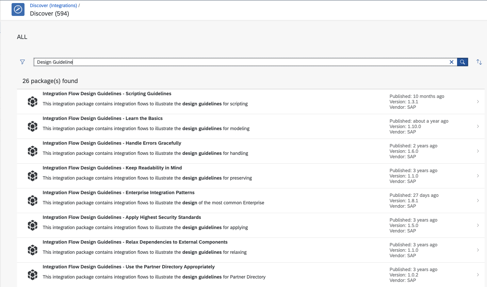
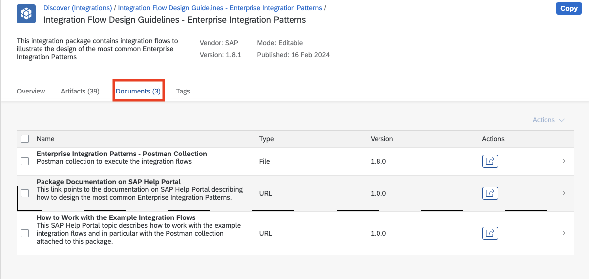
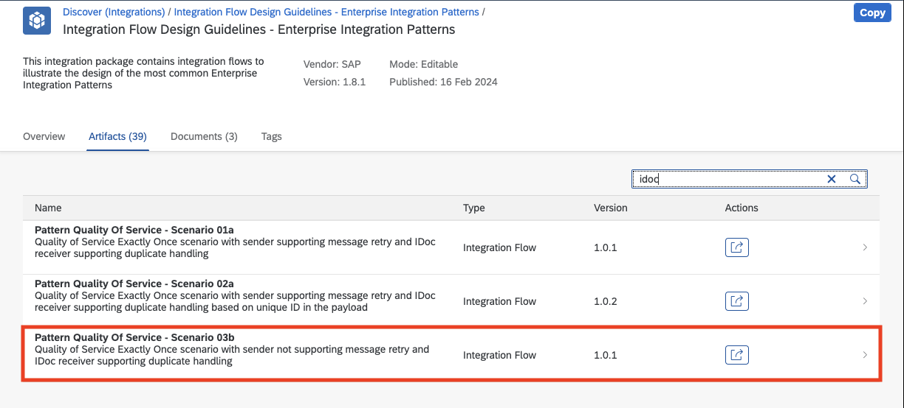

# 演習9.次のステップに向けて: Integration Flow Design Guidelineの確認

## 目的
SAP Integration Suite にはSAPが提供するベストプラクティスとしてIntegration Flow Design Guidelne がご利用いただけます。今後のシステム連携プロセス作成の際にこちらをお役立ていただくことが出来ます。

>Integration Flow Design Guidelne: SOPA→iDoc 連携のプロセスを確実に一度実施するフロー(Sender がリトライに未対応の場合)

## 手順

ステップ1: Itengration Suite での検索

内容を開く

 1. Integration Suiteにアクセスします。
    
    
>Integration Suite へは、URL はhttps://`ご利用のIntegration Suite のアドレス`/shell/home でアクセス出来ます。

 2. メニューから`Discover` → `Integration` を選択します。
    
    

 3. 検索フィールドに`Design Guideline`と入力して`エンターキー`を押してください。
    
    

 4. 結果として以下のように`Design Guideline`が含まれているPackage が表示されます。
    
    

ステップ2: Package "Integration Guideline - Enterprise Integration Pattern"への検索と関連ドキュメントの確認

内容を開く

 1. 一覧の中から、`Integration Design Guideline - Enterprise Integration Pattern` を選択します。
    
    

 2. 開いたページにあるタブから`Documents`を選択してください。３つの関連ドキュメントが参照可能です。
    
    

 3. 一番上の`Enterprise Integration Patterns - Postman Collection`をクリックします。結果として、このパッケージ内に含まれるIntegration Flow を実行するためのPOSTMAN のCollection がダウンロードされます。
    
    

 4. 二番目の`Package Documentation on SAP Help`をクリックします。

    
    
    >以下のように、上記の結果として別のタブでEnterprise向けのIntegration Flow を作成する場合の一般的なパターンをデザインする際のSAP Help内のガイドが表示されます。
    
    
 5. Integration Suite のタブに戻り、三番目の`How to Work with the Example Integration Flows`をクリックします。
    
    
  　
   >以下のように、上記の結果として別のタブでDesign Guide に含まれるサンプルを実行するためのSAP Help内のガイドが表示されます。(POSTMAN のコレクションの利用方法も含む。)
   

ステップ3: iDoc に関連するフロー "Pattern Quality Of Service - Scenario 03b"へのアクセス

内容を開く

    
1. Integration Suite のページに戻り、ページにあるタブから`Artfifacts`を選択します。

     
   
2. 検索フィールドに`idoc`と入力してください。結果として`idoc`に関連する３つのArtifacts に表示が絞られます。

     
   
3. 3つのArtifacts から`Pattern Quality Of Service - Scenario 03b`を選択します。

   

   結果として、以下のようにIntegration Flow `Pattern Quality Of Service - Scenario 03b`が表示されます。
   
   
   
   > このフローはQuality of Service (QoS: ネットワーク上でのデータ品質)をSOAP → iDoc 連携で行う際のプロセス補償を行うためのフローの一種です。
   > この方法は様々ありますが、この場合はSned 側がQoSを担保する機能がない場合に、Integration Suite の中でQoSを実現する場合の手法です。
   > 具体的には、Integration Suite内のJMSのメッセージキューに格納することでメッセージングの仕組みを用いてQoSを担保するフローを作成しています。

## まとめ
今後、SAP Integration Suite でIntegration Flow を開発する場合に参考となるIntegration Design Guidelineを参照することことで、適切なプロセスフローを構築することが可能になります。
